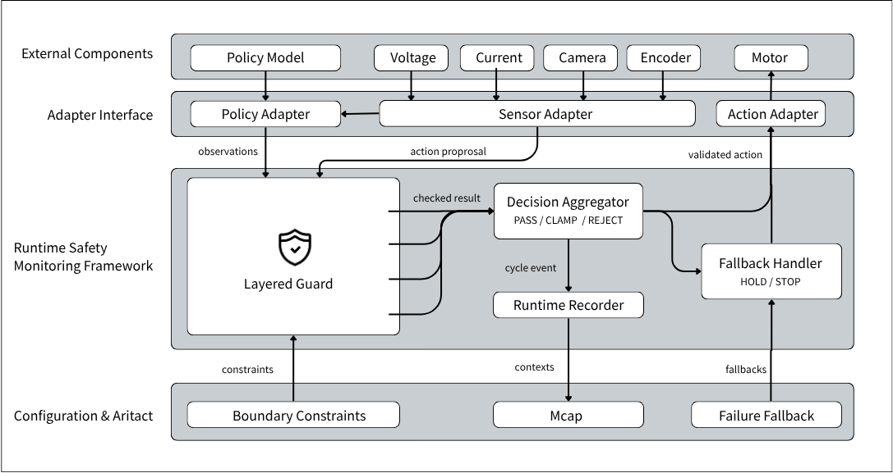
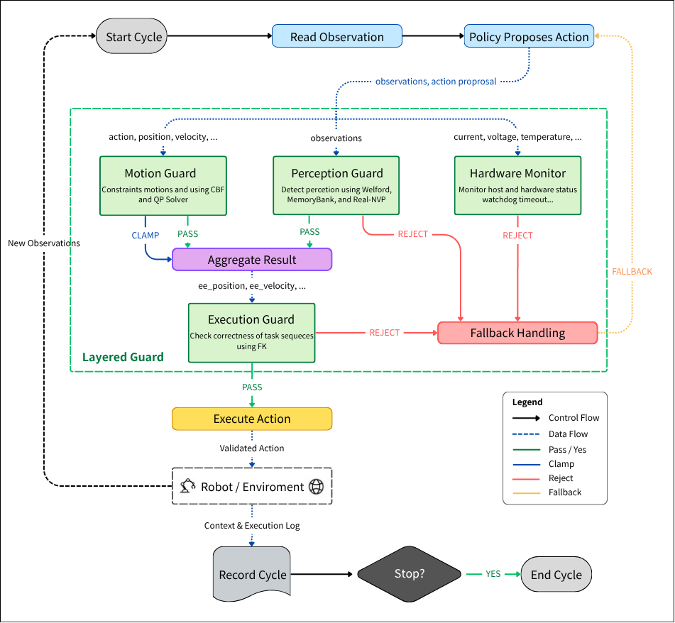

<div align="center">

<h1>Detachable Action Monitor (DAM)</h1>

Detachable safety. Observable control.

[](https://www.python.org/downloads/)
[](https://www.rust-lang.org/)
[](LICENSE)
[](https://github.com/ez945y/DAM/discussions)

[Features](#features) • [Quick Start](#quick-start) • [Documentation](#documentation) • [Configuration](#configuration)
</div>


https://github.com/user-attachments/assets/a10711ea-a419-4aee-ba06-de1e2d437d49


**DAM** is a detachable safety middleware that sits between any machine learning policy (or controller) and robot hardware. It intercepts every proposed action, evaluates it through a layered guard stack (L0–L3), and either **passes**, **clamps**, or **rejects** it — without modifying the policy weights or hardware drivers.

This design keeps safety boundaries explicit while leaving the learning/policy layer detachable and upgradable.

### Features

- **Graduated L0-L3 pipeline**: Validates OOD, motion feasibility, task logic, and hardware health with fallback escalation.
- **Stackfile-driven config**: Robots, policies, guards, boundaries, and tasks are YAML-defined and validated via `dam validate`.
- **MCAP loopback logging**: Records observations, actions, guard decisions, and safety events for replay and review.
- **Cycle inspection**: Audits control loops with guard decisions, latency, and observation/action context in the console.
- **Predictable runtime path**: Keeps high-volume logging and messaging off the policy path for steadier control-loop timing.
- **Adapter isolation**: Swaps LeRobot, ROS 2, dataset, or custom adapters without changing guard logic.

**Disclaimer**: DAM is experimental research software and not certified for safety-critical or production environments.


---

### Quick Start

```bash
git clone https://github.com/ez945y/DAM.git
cd DAM
make setup
make run
```

Open **http://localhost:3000** for the DAM Console and **http://localhost:8080/docs** for API docs.

For the guided no-hardware path, see [Quick Start](docs/getting-started/quickstart.md).

| Command      | Description                                              |
|--------------|----------------------------------------------------------|
| `make setup` | Create venv, compile Rust extension, install dependencies |
| `make build` | Build the production frontend after UI changes           |
| `make run`   | Start backend (:8080) + pre-built frontend (:3000)       |
| `make validate` | Validate example Stackfiles                          |
| `make docs-check` | Run strict MkDocs and documentation pattern checks |
| `make test`  | Run full test suite (unit + integration + safety)       |
| `make clean` | Remove build artifacts                                  |

The `dam` CLI is available after `make setup`:

```bash
.venv/bin/dam doctor                                # check environment / dependencies
.venv/bin/dam callbacks                             # list built-in boundary callbacks
.venv/bin/dam inspect examples/stackfiles/demo.yaml # print the resolved Stackfile graph
.venv/bin/dam validate examples/stackfiles/*.yaml   # schema-check Stackfiles (CI gate)
.venv/bin/dam run examples/stackfiles/demo.yaml --cycles 200 --task demo
.venv/bin/dam replay <session>.mcap                 # summarise a recorded session
.venv/bin/dam help [command]
```

After starting, open **http://localhost:3000** in your browser and use the console
to inspect guard decisions, latency, and runtime status. Start with
`examples/stackfiles/demo.yaml` before moving to SO-ARM101 hardware or a custom
Stackfile.

---

### Documentation

| Goal | Start here |
|------|------------|
| Learn DAM step by step | [Learn DAM](docs/learn/index.md) |
| Read a Stackfile | [Stackfile Walkthrough](docs/getting-started/stackfile-walkthrough.md) |
| Make safe config edits | [Common Stackfile Edits](docs/getting-started/common-stackfile-edits.md) |
| Understand the console | [Console Walkthrough](docs/getting-started/console-walkthrough.md) |
| Prepare for hardware | [Hardware Readiness](docs/getting-started/hardware-readiness.md) |
| Fix first-run issues | [Troubleshooting](docs/getting-started/troubleshooting.md) |

Preview the MkDocs site locally:

```bash
make docs
```

---

### Configuration

#### System Architecture



#### Workflow




**Guard Layers**

| Layer | Name                    | Responsibility                                      |
|-------|-------------------------|-----------------------------------------------------|
| L0    | OOD Detection           | Out-of-distribution observation detection           |
| L1    | Physical Kinematics     | Joint limits, workspace, velocity                   |
| L2    | Task Execution          | Mission progress and boundary enforcement           |
| L3    | Hardware Monitoring     | Temperature, current, voltage, heartbeat            |

The final decision is the **most restrictive** outcome from all active layers.

---

### Contributing

See [Contributing](docs/contributing.md) for details on:
- Setting up the development environment
- Code style and testing requirements
- How to propose new features or guard layers

We especially welcome help in the following areas:
- Safety testing and adversarial scenario development
- Real-time performance optimization
- Additional hardware adapters
- Documentation and example Stackfiles

---

**DAM aims to make advanced robot safety modular, verifiable, and accessible to the embodied AI community.**

Feedback and discussions are highly encouraged in [GitHub Discussions](https://github.com/ez945y/DAM/discussions).
