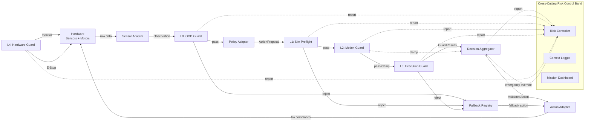
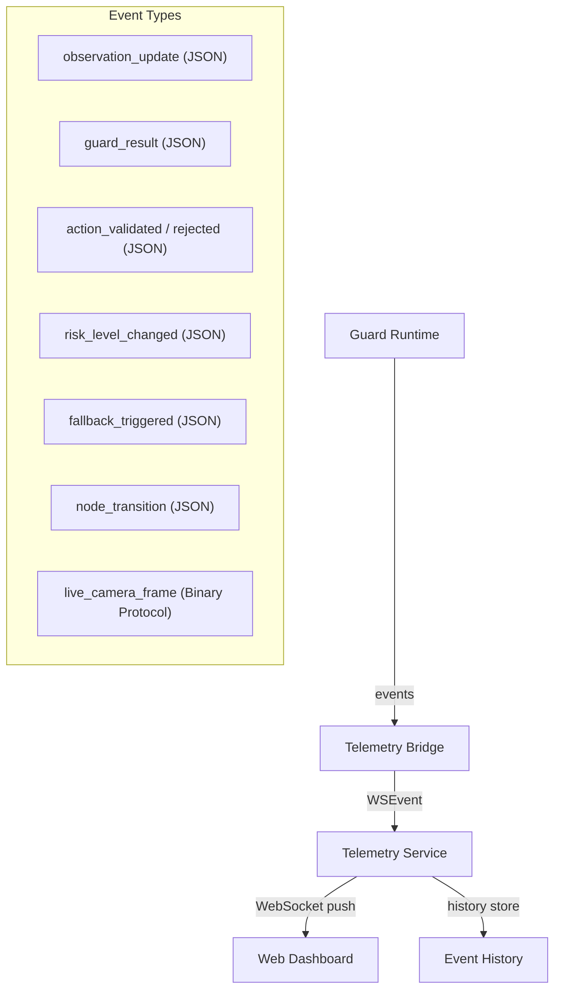
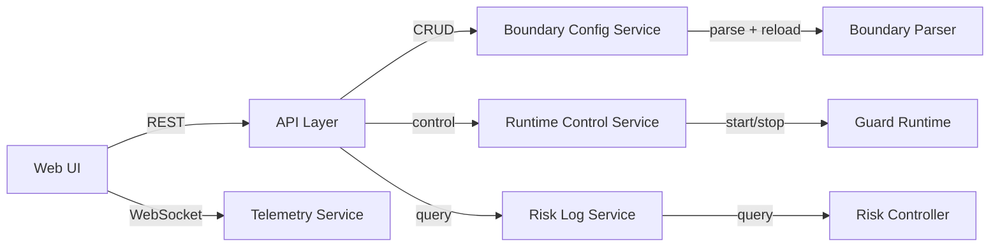
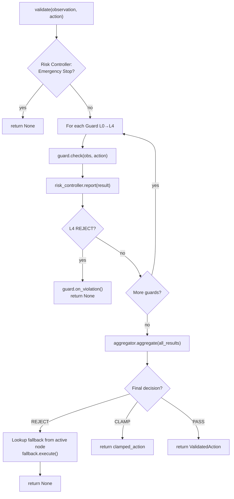
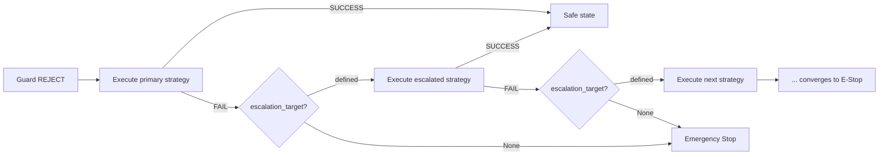

# DAM Architecture Reference

> **DAM: Detachable Action Monitor**
> Restructured Architecture Reference · April 2026

---

## Table of Contents

- [Glossary](#glossary)
0. [User-Facing Overview](#0-user-facing-overview)
1. [Core Components](#1-core-components)
2. [Technology Stack](#2-technology-stack)
3. [Design Decisions](#3-design-decisions)
4. [Communication Map](#4-communication-map)
5. [Interface Contract & Infrastructure Layer](#5-interface-contract--infrastructure-layer)
6. [Stackfile Reference](#6-stackfile-reference)
7. [Syntax Sugar Reference](#7-syntax-sugar-reference)
8. [Pipeline](#8-pipeline)
9. [Component Deep Dives](#9-component-deep-dives)
10. [SDK & External API Dependencies](#10-sdk--external-api-dependencies)
11. [Function Implementation Table](#11-function-implementation-table)
12. [Testing Strategy](#12-testing-strategy)
13. [Development Roadmap](#13-development-roadmap)

---

## Glossary

Reference for all DAM-specific terms, categorized by architectural role and sorted by importance.

### 1. Core Architecture
| Term | Definition |
| :--- | :--- |
| **DAM** | **Detachable Action Monitor** — the framework name. Sits between a policy and hardware as a removable safety layer that does not require changes to policy weights or driver code. |
| **Runner** | DAM entry-point class. Wraps `PolicyAdapter.predict()` and the guard stack; exposes `step(obs)` / `run()` loop. Users instantiate Runner with a Stackfile path. |
| **Stackfile** | The primary YAML configuration file for a DAM deployment. Declares hardware wiring, guard profiles, simulation config, and static parameters. |
| **Control Plane** | The Python layer: guard logic, boundary evaluation, adapter orchestration, and policy/simulator interfaces. |
| **Data Plane** | The Rust layer: high-performance buses, RiskController, and hardware I/O. Bypasses Python GIL for deterministic throughput. |
| **Task** | The primary runtime entity. Has a name, an associated `BoundaryContainer`, and a lifecycle (`start` / `stop`). One process may run multiple tasks. |

### 2. Execution Pipeline
| Term | Definition |
| :--- | :--- |
| **Stage DAG** | Directed Acyclic Graph that organises guards into parallel and sequential execution stages (e.g., L0 gate → L2 ‖ L1 → L3). |
| **CycleResult** | Enriched return value from `dam.step()`. Contains `validated_action`, `guard_results`, `latency_ms`, and `risk_level`. Used for reward shaping. |
| **ActionProposal** | Raw action tensor emitted by the policy. Not yet validated; may be clamped or rejected by guards. |
| **ValidatedAction** | Action that has passed all active guards (possibly modified). Delivered to `SinkAdapter` for hardware dispatch. |
| **Observation** | Structured snapshot of sensor state delivered to guards each cycle via `ObservationBus`. Immutable within a cycle. |
| **DecisionAggregator** | Final stage of the Stage DAG. Merges `GuardResult` votes into a single `Decision` (PASS / CLAMP / REJECT / FAULT). |
| **Decision** | Enum output of the aggregator. Drives the final action dispatch or fallback chain. |

### 3. Safety & Enforcement
| Term | Definition |
| :--- | :--- |
| **Guard** | A Python class decorated with `@dam.guard` that implements `check(**kwargs) → GuardResult`. The unit of safety logic. |
| **GuardProfile** | Named subset of guards + enforcement mode declared in Stackfile. Activated via `dam.use_profile()`. |
| **GuardLayer** | Conceptual grouping of guards: L0 (OOD), L1 (Sim), L2 (Motion), L3 (Execution), L4 (Hardware). |
| **GuardResult** | Return type of `guard.check()`. Contains `decision`, `reason`, and optionally `clamp_target`. |
| **Boundary** | A named safety constraint node in YAML. Boundaries are M:N-mapped to Python callbacks. |
| **Enforcement Mode** | Per-profile policy: `enforce` (block unsafe actions), `monitor` (log only), or `log_only` (silent). |
| **RiskLevel** | Enum produced by `RiskController`: `NOMINAL`, `ELEVATED`, `CRITICAL`. Included in `CycleResult`. |
| **Fallback Strategy** | User-defined action taken when a guard REJECTS a proposal (e.g., `stop`, `hold_position`). |
| **Fault** | A guard result indicating an exception or timeout. Treated as REJECT under fail-safe semantics. |
| **E-Stop** | Emergency Stop. Hardware-level halt triggered when `RiskLevel` is CRITICAL or watchdog expires. |

### 4. System Infrastructure
| Term | Definition |
| :--- | :--- |
| **ObservationBus** | Rust ring buffer that ingests raw sensor data and snapshots it atomically for guards. |
| **ActionBus** | Rust channel carrying actions from Python to hardware. Decouples output from dispatch. |
| **MetricBus** | Rust channel for per-cycle telemetry (latency, risk score). Aggregated by `RiskController`. |
| **NodeBus** | Rust-side pub/sub router for intra-process guard-to-guard messaging. |
| **InjectionPool** | Merged dict of Runtime Pool (obs, cycle_id, etc.) and Config Pool (static params) used to populate guard arguments. |
| **PolicyAdapter** | User class wrapping a policy model. Public interface: `predict(obs) → ActionProposal`. |
| **SimulatorAdapter** | User class wrapping a physics simulator for L1 Sim Preflight. |
| **Source/Sink Adapter** | Classes that ingest raw sensor data or deliver validated actions to hardware (ROS2, CAN, etc.). |
| **Lookahead** | Mechanism used by L1 to evaluate a proposed action in simulation one cycle ahead on a shadow thread. |
| **MCAP** | Binary log format used for ObservationBus persistence and violation context capture. |
| **WatchdogTimer** | Rust hardware timer that triggers E-Stop if the control loop exceeds its `cycle_budget_ms`. |
| **PyO3** | Rust–Python FFI library used to expose Rust data-plane components to the Python control plane. |

---

## 0. User-Facing Overview

DAM sits between your policy and your hardware as a **detachable safety layer**. You can attach it to any robot setup without modifying policy weights, training pipelines, or existing driver code.

### What You Define

DAM users fall into three tiers. Higher tiers are additive — each includes everything below.

**Tier 1 — Minimal (YAML only)**

| What | How | Where |
| :--- | :--- | :--- |
| **Hardware sources** | Declare topic / port / driver | Stackfile `hardware.sources` |
| **Hardware sinks** | Declare topic / port / driver | Stackfile `hardware.sinks` |
| **Policy** | Declare type + pretrained path | Stackfile `policy` |
| **Built-in guards** | Enable / tune params | Stackfile `guards.builtin` |
| **Safety boundaries** | Write YAML nodes + built-in constraints | Stackfile `boundaries` |
| **Tasks** | Declare name + which boundaries activate | Stackfile `tasks` |

No Python file required. Run with `dam run --stack stackfile.yaml --task <name>`.

**Tier 2 — Basic (YAML + Python callbacks)**

| What | How | Where |
| :--- | :--- | :--- |
| **Custom constraint checks** | Python function + `@dam.callback` | Your Python file |
| **Custom fallback strategies** | Python class + `@dam.fallback` | Your Python file |

Reference callbacks from boundary nodes via `callback: [fn_name]`.

**Tier 3 — Advanced (YAML + custom adapters / guards)**

| What | How | Where |
| :--- | :--- | :--- |
| **Custom guards** | Python class + `@dam.guard(layer=…)` | Your Python file |
| **Custom source / sink type** | Python class + `@dam.source_type` | Your Python file |
| **Custom policy adapter** | Python class + `@dam.policy_type` | Your Python file |
| **Custom simulator adapter** | Python class subclassing `SimulatorAdapter` | Your Python file |

### What DAM Provides Automatically

Everything else — you write none of this:

- Control loop (managed or passive step mode)
- Hardware connection lifecycle (connect / disconnect / reconnect)
- Observation snapshot assembly from all sources each cycle
- Guard pipeline orchestration (Stage DAG, parallel execution)
- Decision aggregation (REJECT > CLAMP > PASS)
- Fallback escalation chain
- Risk Controller (windowed metric aggregation in Rust)
- Hardware E-Stop (Rust, independent of Python GIL)
- MCAP loopback buffer (rolling 30 s context capture on violation)
- Hot reload of boundaries and callbacks
- WebSocket telemetry and REST API
- Distributed tracing (trace_id propagated per cycle)

### Coarse-Grained Runtime Flow

```
 ┌─────────────────────────────────────────────────────────────┐
 │  DEFINE (offline)                                           │
 │  Stackfile YAML  +  Python callbacks / custom guards        │
 └────────────────────────────┬────────────────────────────────┘
                              │  dam run --stack stackfile.yaml
 ┌────────────────────────────▼────────────────────────────────┐
 │  CONNECT                                                    │
 │  DAM auto-wires multi-Sources → ObservationBus (Merged)     │
 │             Sinks   ← ActionBus                             │
 │             Policy, Simulator loaded and injected           │
 └────────────────────────────┬────────────────────────────────┘
                              │  dam.start_task("pick_and_place")
 ┌────────────────────────────▼────────────────────────────────┐
 │  EXECUTE  (per cycle, 50 Hz default)                        │
 │  Sense → [L0 gate] → Think → [L1‥L3 validate] → Act        │
 │                              └─ L4 hardware monitor (async) │
 └────────────────────────────┬────────────────────────────────┘
                              │  guard returns REJECT
 ┌────────────────────────────▼────────────────────────────────┐
 │  MONITOR / REACT                                            │
 │  Risk Controller updates risk level                         │
 │  Fallback escalation chain executes                         │
 │  MCAP context snapshot captured (±30 s around violation)    │
 │  Telemetry pushed to dashboard                              │
 └─────────────────────────────────────────────────────────────┘
```

### Minimum User Code

**Tier 1 — YAML only (no Python at all):**
```bash
dam run --stack stackfile.yaml --task pick_and_place
```

**Tier 2 — add a custom constraint check:**
```python
# callbacks.py

import dam

@dam.callback("check_grasp_force")
def check_grasp_force(obs, max_force_n: float) -> bool:
    return float(obs.force_torque[2]) < max_force_n
```
```bash
dam run --stack stackfile.yaml --task pick_and_place --python callbacks.py
```

**Task switching at runtime (Python entry point):**
```python
# No TaskDefinition class needed — tasks are purely declarative in YAML.
# Python just calls the lifecycle API:

runner = dam.Runner("stackfile.yaml")
runner.start_task("pick_and_place")   # activates the boundary list defined in YAML
# ... run loop ...
runner.stop_task()
runner.start_task("sorting_box")      # switches to a different boundary set
```

Everything else — hardware connection, policy inference, guard pipeline, fallback, telemetry — is handled by DAM from the Stackfile.

---

## 1. Core Components

DAM's modules are organized into two distinct responsibilities: **Core Guard Logic** (safety decision-making) and **Infrastructure / Utility** (integration glue). Keeping this separation clear is critical — infrastructure modules are policy-agnostic and hardware-agnostic wrappers; only the guard modules carry safety semantics.

> Infrastructure modules (Adapters, Parsers) are defined in [§5 Interface Contract & Infrastructure Layer](#5-interface-contract--infrastructure-layer).

### 1.1 Core Guard Logic

7 modules that carry **safety decision-making authority**, organized across 5 layers and a cross-cutting risk control band.

| Module | Layer | Role |
| :--- | :--- | :--- |
| **Guard Runtime** | Core | Orchestrates all guards, aggregates decisions, merges named sources |
| **OOD Guard** | L0 | Rejects out-of-distribution observations (autoencoder) |
| **Simulation Preflight Guard** | L1 | Pre-executes actions in simulation to detect collisions |
| **Motion Guard** | L2 | Enforces joint limits, velocity, acceleration, workspace |
| **Execution Guard** | L3 | Monitors boundary container constraints + node timeouts |
| **Hardware Guard** | L4 | Monitors current, temperature; triggers hardware E-Stop |
| **Risk Controller** | Cross-cutting | Windowed risk tracking, global emergency override |

### Supporting Modules

| Module | Role |
| :--- | :--- |
| **Decision Aggregator** | Merges multiple `GuardResult` → final PASS / CLAMP / REJECT |
| **Callback Registry** | Central store for Python boundary check functions (M:N mapping) |
| **Fallback Registry** | Central store for fallback strategies with auto-escalation |
| **Telemetry Service** | WebSocket-based real-time event streaming |
| **Boundary Config Service** | REST CRUD for boundary container management |
| **Runtime Control Service** | REST API for start / pause / resume / stop / E-Stop |
| **Risk Log Service** | Query historical risk events, export context datasets |
| **Context Logger** | Captures 30s MCAP context snapshot around each violation |

---

## 2. Technology Stack

### Control Plane (Python)

| Category | Technology | Purpose |
| :--- | :--- | :--- |
| **Core Language** | Python 3.10+ | Guard logic, adapters, boundary definitions, fallback strategies |
| **Configuration** | YAML (Stackfile) | Guard params, boundary definitions, task mappings, node graphs |
| **Callback System** | Python Callables + `inspect` | Auto-injected boundary check functions, transition conditions |
| **Middleware** | ROS 2 (optional) | Sensor topics, action servers — declared as Sources/Sinks in Stackfile |
| **Simulation** | Isaac Sim, Gazebo | L1 Sim Preflight lookahead via SimulatorAdapter (optional, late-phase) |
| **OOD Detection** | Autoencoder (PyTorch) | Reconstruction error–based anomaly detection |
| **Policy Inference** | PyTorch / ONNX | LeRobot ACT, Diffusion Policy, VLA, RL agents — wrapped via PolicyAdapter |
| **API (REST)** | FastAPI / Flask | Boundary CRUD, runtime control, risk logs |
| **API (Real-time)** | WebSocket | Observation, guard results; high-performance binary JPEG stream |
| **Data Format** | MCAP | Loopback ring buffer persistence, context capture, dataset export |
| **Type Contracts** | Python `dataclass` + `ABC` | Enforced at module boundaries |

### Data Plane (Rust + PyO3)

| Module | Technology | Purpose |
| :--- | :--- | :--- |
| **ObservationBus** | Rust + PyO3 + MCAP | Lock-free ring buffer backed by MCAP; Python guards pull snapshots via PyO3; L1 lookahead replays from MCAP |
| **ActionBus** | Rust + PyO3 | Fallback strategies write `ValidatedAction` to hardware queue via PyO3 |
| **MetricBus** | Rust + PyO3 | Per-guard SPSC channels; Python pushes `GuardResult` summaries after each check |
| **RiskController** | Rust + PyO3 | Windowed aggregation on MetricBus; atomic emergency flag read by Python |
| **NodeBus** | Rust + PyO3 | Cross-node observation subscriptions; Python guards pull remote node state |
| **WatchdogTimer** | Rust + PyO3 | Cycle deadline enforcement; timeout → `GuardResult.fault()` |
| **Hardware I/O** | Rust (no PyO3) | Serial / CAN direct read-write; Python never touches hardware layer |
| **E-Stop Signal** | Rust (no PyO3) | Hardware-level stop triggered by Rust independently of Python GIL |

---

## 3. Design Decisions

### 3.1 Deterministic Safety over Probabilistic Output

Neural network policies produce probabilistic action proposals. DAM guarantees that every action dispatched to hardware is **deterministically validated** against explicit boundary rules — the framework never relies on model confidence alone.

### 3.2 Non-Intrusive Integration (Adapter Pattern)

The framework wraps existing policies via **three adapters** (Sensor / Policy / Action) without touching model weights, code, or training pipelines. Swapping from simulation to real hardware requires changing only the Sensor and Action adapters; the Policy adapter remains unchanged.

### 3.3 Boundaries as First-Class Citizens (M:N Mapping)

Safety rules are defined in YAML; logic is implemented in Python callbacks.
The relationship is **Many-to-Many**: one callback can be reused across multiple YAML nodes, and one node can reference multiple callbacks. This decouples structure from logic and maximizes reuse.

```
 YAML Nodes                    Python Callbacks
┌──────────────┐         ┌────────────────────────┐
│ approach     │────────▶│ check_joint_position_limits()   │◀── global_safety
│ grasp        │──┐      ├────────────────────────┤
│ lift         │──┼─────▶│ check_workspace()      │◀── assembly
└──────────────┘  └─────▶│ check_velocity()       │◀── orient nodes
                         └────────────────────────┘
              M : N
```

### 3.4 Boundary Container Architecture (Node → List → Graph)

All boundaries are organized in **Boundary Containers** with three levels of complexity:

| Container Type | Use Case | Transition Logic |
| :--- | :--- | :--- |
| **SingleNodeContainer** | Global safety constraints | No transitions |
| **ListContainer** | Linear sequential tasks (Pick & Place) | Ordered transitions |
| **GraphContainer** | Branching tasks (conditional assembly) | Priority-based, supports loops |

Each container has a single entry point. The system evaluates constraints and transitions at every control cycle step.

### 3.5 Unified Node Principle (Hardware Encapsulation)

Physical hardware entities (motors, arms) are encapsulated as a single **Node** instance. Both `Sensor Adapter` (read) and `Action Adapter` (write) share the same communication interface per node. This:
- Prevents multi-process resource conflicts
- Eliminates state divergence between read and write paths
- Maps directly to the ROS Node/Topic model

```
┌──────────────────────────────────────────────┐
│            Hardware Node (Unified)            │
│  ┌─────────────────┐  ┌──────────────────┐   │
│  │ ObservationIface │  │  ActionInterface │   │
│  │   read_state()   │  │ apply_action()   │   │
│  └─────────────────┘  └──────────────────┘   │
│         [ Driver: Serial / CAN / ROS ]        │
└──────────────────────────────────────────────┘
       ▲ Sensor Adapter reads      ▲ Action Adapter writes
```

### 3.6 Layered Guard Architecture (L0–L4)

Guards are organized in 5 layers, executed sequentially from L0 (perception) to L4 (hardware). If L4 issues a REJECT, it **short-circuits** immediately — no further checks are needed because hardware-level danger is absolute.

### 3.7 Decision Aggregation: REJECT > CLAMP > PASS

All guard results are merged by the **Priority Decision Aggregator**:
- Any REJECT → final REJECT (highest-layer REJECT takes precedence)
- No REJECT but any CLAMP → final CLAMP (apply the clamped action)
- All PASS → final PASS

### 3.8 Fallback Escalation Chain

Every fallback strategy declares its own `escalation_target`. On failure, the registry automatically escalates up the chain. All chains converge to `emergency_stop` as the irrevocable terminal state.

```
gentle_release ──fail──▶ return_to_home ──fail──▶ emergency_stop
hold_position  ──fail──▶ return_to_home ──fail──▶ emergency_stop
reverse_motion ──fail──▶ hold_position  ──fail──▶ return_to_home ──▶ emergency_stop
human_takeover ──timeout─▶ return_to_home ──fail──▶ emergency_stop
switch_policy  ──fail──▶ return_to_home ──fail──▶ emergency_stop
```

### 3.9 Dual Stack: Control Plane (Python) + Data Plane (Rust)

Python carries safety decision semantics; Rust carries real-time data throughput. The boundary is enforced by PyO3 bindings that expose only typed, serializable interfaces — guards never import concrete Rust structs directly.

```
┌──────────────────────────────────────────────────────────┐
│               Control Plane  (Python)                    │
│  Guard Logic · Boundary Definitions · Policy Inference   │
│  Adapter Format Conversion · Fallback Strategy Logic     │
└────────────────────┬─────────────────────────────────────┘
                     │  PyO3 bindings (typed read/write API)
┌────────────────────▼─────────────────────────────────────┐
│                Data Plane  (Rust)                        │
│  ObservationBus · ActionBus · MetricBus · NodeBus        │
│  RiskController · WatchdogTimer · Hardware I/O · E-Stop  │
└──────────────────────────────────────────────────────────┘
```

Python interacts with the data plane at exactly three points per cycle:
1. **Pull** — read `Observation` snapshot from ObservationBus
2. **Push** — write `GuardResult` summary to MetricBus after each guard check
3. **Write** (fallback only) — write `ValidatedAction` to ActionBus

### 3.10 Decorator-Based Registration & Dual Injection Pool

All user-facing modules are registered via Python decorators. The framework resolves dependencies by inspecting the function signature at import time (`inspect.signature`). Unknown parameter names raise a `ValueError` at registration — not at runtime.

Two separate injection pools supply parameters to guards and callbacks:

| Pool | Source | Updated | Example keys |
| :--- | :--- | :--- | :--- |
| **Runtime Pool** | Rust ObservationBus / cycle pump | Every cycle | `obs`, `action`, `node_bus`, `cycle_id`, `trace_id`, `timestamp` |
| **Config Pool** | YAML Stackfile `params:` block | At load / hot-reload only | `upper_limits`, `max_velocity`, `force_threshold`, any user-defined param |

Config Pool values are static between hot-reloads. The framework pre-splits each guard's parameter list at startup so the per-cycle hot path only touches runtime keys:

```python
# ── Startup / hot-reload: runs once per guard ───────────────────────────────
for guard in active_guards:
    sig_keys = guard._cached_param_names          # stored by @dam.guard at import time
    guard._static_kwargs = {k: config_pool[k]     # frozen; never rebuilt per-cycle
                            for k in sig_keys if k in config_pool}
    guard._runtime_keys  = [k for k in sig_keys   # only these are looked up per-cycle
                            if k in RUNTIME_POOL_KEYS]

# ── Per-cycle hot path: 2–4 dict lookups, no parsing, no merge ─────────────
runtime_kwargs = {k: runtime_pool[k] for k in guard._runtime_keys}
result = guard.check(**guard._static_kwargs, **runtime_kwargs)
```

Cross-process guards (`process_group=`) may only reference config_pool keys (serializable primitives). Runtime pool objects are passed via shared memory, not pickle.

### 3.11 Dual-Mode Entrypoint

| Mode | API | Use Case |
| :--- | :--- | :--- |
| **Passive (Manual Step)** | `dam.step()` | ROS2 `timer_callback`, LeRobot control loop — user owns the outer loop |
| **Managed Loop** | `dam.run()` | Standalone deployment — framework owns a high-priority thread |

In both modes, Sensor Adapters update `latest_obs` asynchronously in the background. `step()` / the managed loop always pulls the latest available snapshot — it never blocks waiting for the adapter. Stale-data detection uses `timestamp` comparison against a configurable `max_obs_age_sec`.

### 3.12 Fail-to-Reject Safety Guarantee

Every `guard.check()` call is wrapped by the framework in a `try / except`. Any unhandled exception produces `GuardResult.fault()`. Fault is treated as `REJECT` in the Decision Aggregator and triggers the escalation chain.

The telemetry log distinguishes fault origin:

| Log field `fault_source` | Meaning |
| :--- | :--- |
| `"environment"` | OOD / hardware anomaly — expected safety condition |
| `"guard_code"` | Exception in user's `check()` — indicates a bug |
| `"timeout"` | WatchdogTimer expired — guard exceeded cycle budget |

This lets operators separate "the robot is in a dangerous state" from "the safety code itself is broken."

### 3.13 Task Lifecycle & Config-Driven Boundary Mapping

Tasks are the primary entity. Each task declares which boundary container governs it and what happens if no match is found.

```yaml
# stackfile.yaml
tasks:
  pick_and_place:
    primary_boundary: pick_place_v1
    fallback_boundary: default_safety_envelope
  sorting_box:
    primary_boundary: sort_box_v2
    fallback_boundary: default_safety_envelope
```

`dam.start_task("pick_and_place")` performs an O(1) lookup, activates `pick_place_v1` in the Boundary Scheduler, and freezes all other containers. If no matching task is found, the system enters the most restrictive safe-stop state immediately — it never runs without a known boundary context.

```python
dam.start_task("pick_and_place")
dam.pause_task()
dam.resume_task()
dam.stop_task()   # → safe-stop, boundary deactivated
```

### 3.14 Stage DAG: Ordered + Parallel Guard Execution

Guards are organized into execution stages with explicit dependencies. Within a stage, guards run in parallel (separate threads or processes); across stages, execution is ordered.

```
[Stage 0]  Observation snapshot pulled from ObservationBus
               │
[Stage 1]  L0 OOD Guard                   ← synchronous gate; REJECT short-circuits
               │ pass
[Stage 2]  L2 Motion  ║  L1 Sim Preflight (async lookahead shadow thread)
               │ L2 output: clamped_action or original
[Stage 3]  L3 Execution Guard              ← consumes L2 output, not raw proposal
               │
[Stage 4]  Decision Aggregation            ← collects stage 2+3; timeout → fault
               │
[Stage 5]  Act via ActionBus
[Always]   L4 Hardware Guard               ← independent async monitor, not in DAG
```

L1 Sim Preflight runs on a shadow thread with a lookahead buffer. Its result is incorporated if available before the Stage 4 deadline; otherwise it is marked `TIMEOUT` and logged to Risk Controller without blocking the cycle.

The layer strings ("L0"–"L4") passed to `@dam.guard(layer=…)` are converted to `GuardLayer(IntEnum)` at decoration time. The Stage DAG is built as a `list[list[Guard]]` at startup — per-cycle execution is pure list iteration with no string comparison or dynamic lookup. See §3.19 for the full static acceleration strategy.

### 3.15 Declarative Sources / Sinks — DAM Owns the Entry Point

Users never write a control loop or a ROS2 node. They declare **where data comes from** (Sources) and **where validated actions go** (Sinks) in the Stackfile. DAM auto-creates all subscriptions, publishers, and hardware connections at startup.

```
Sources  →  ObservationBus  →  Guard Runtime  →  ActionBus  →  Sinks
(declare)     (Rust/MCAP)      (Python guards)    (Rust)       (declare)
```

Built-in source types: `ros2_topic`, `ros2_action`, `lerobot`, `serial`, `can`, `isaac_sim`, `custom`. Each source publishes to the ObservationBus at its native frequency; the Guard Runtime reads the latest available snapshot each cycle (last-value-hold). This decouples sensor refresh rates from the control loop frequency.

### 3.16 Policy Adapter is Predict-Only; L1 Orchestrates Policy + Simulator

The Policy Adapter exposes exactly one interface to the rest of the system:

```
predict(obs: Observation) → ActionProposal
```

It receives the canonical `Observation` (already converted from raw platform data by the Sources) and knows nothing about simulation or guards. All platform-specific conversion is internal to the adapter.

The **L1 Sim Preflight Guard** is the only component that jointly references both `PolicyAdapter` and `SimulatorAdapter`. It uses the standard `predict()` interface to run a multi-step lookahead in simulation — the Policy Adapter is unaware it is being called inside a simulation loop. This keeps the Policy Adapter single-purpose and swappable without affecting L1's logic.

```
L1 lookahead:
  sim_obs = current_obs
  for step in range(lookahead_steps):
      sim_obs  = simulator.step(current_action)   # SimulatorAdapter
      if simulator.has_collision(): → REJECT
      current_action = policy.predict(sim_obs)    # PolicyAdapter (unchanged interface)
```

Both `policy` and `simulator` are injected into L1's `check()` via the runtime pool — L1 declares them as parameters, the framework resolves them.

### 3.17 Runner Pattern — LeRobot and ROS2 as Library Adapters

DAM does not wrap CLI tools. Instead, it provides **Runner classes** that use each platform's library API directly:

- `dam.LeRobotRunner(robot, policy, stack)` — calls `make_robot()`, `make_policy()` internally; user never writes a control loop
- `dam.ROS2Runner(node, stack)` — creates subscriptions/publishers inside an existing ROS2 node; integrates with the ROS2 executor via a timer callback
- `dam.run(stack)` — fully managed; DAM owns everything from hardware connection to action dispatch

In all cases, the user's contribution is the Stackfile (declarative) and optionally Python classes for custom guards, callbacks, and fallback strategies. The control loop, hardware lifecycle, and validation pipeline are always owned by DAM.

### 3.18 Guard Profiles + Monitor Mode (Training Support)

DAM supports three **runtime enforcement modes** and **named guard profiles** to cover training, evaluation, and production deployment without changing guard code.

**Enforcement Modes:**

| Mode | Guard pipeline | Action dispatched | Use case |
| :--- | :--- | :--- | :--- |
| `enforce` | Full validation | `ValidatedAction` (clamped or rejected) | Production deployment |
| `monitor` | Full validation (runs but does not block) | Original `ActionProposal` unchanged | Policy evaluation, safety labelling, baseline violation rate |
| `log_only` | Runs guards, records results | Original `ActionProposal` unchanged | Dataset annotation during demonstration recording |

**Named Profiles** allow different guard subsets per scenario, declared in Stackfile and selected at runtime:

```yaml
profiles:
  training_rl:
    active_guards: [motion, hardware]   # white-list; others are skipped entirely
    mode: enforce
    cycle_budget_ms: 5                     # tight latency for fast RL loops

  demo_recording:
    active_guards: [motion, execution]
    mode: log_only

  evaluation:
    active_guards: [ood, motion, execution, hardware]
    mode: monitor                          # observe full pipeline, do not enforce
```

```bash
dam run --stack stackfile.yaml --profile training_rl --task pick_and_place
```

### 3.19 Static Acceleration: Startup Pre-computation

Everything that does not change per-cycle is computed once at startup (or on hot-reload) and frozen. The per-cycle hot path contains no string comparisons, no YAML parsing, and no signature inspection.

| Item | When computed | Hot-path cost |
| :--- | :--- | :--- |
| Signature inspection (`inspect.signature`) | `@dam.guard` / `@dam.callback` at import | Zero — cached as `list[str]` |
| `GuardLayer` ("L0"–"L4" → `IntEnum`) | Decoration time | Zero — string never re-evaluated |
| Stage DAG topology | Startup | `list[list[Guard]]` — pure index access |
| `_static_kwargs` per guard/callback | Startup / hot-reload | Frozen `dict` unpack, O(1) per key |
| `_runtime_keys` per guard/callback | Startup / hot-reload | `list[str]`, 2–4 dict lookups per cycle |
| Constraint values (floats, arrays) | Startup / hot-reload | Native Python / numpy types, no parsing |
| `bounds` | Startup / hot-reload | Pre-converted to `np.ndarray` |
| Fallback chain pointers | Startup | Linked object list, no string lookup |
| Decision aggregation order | Startup | `max()` over `GuardDecision(IntEnum)` |
| Process group affinity | Startup | Guard instances pre-bound to executor |
| WatchdogTimer deadline | Startup | Loaded into Rust as `u32` ms |

**What must remain per-cycle** (semantically necessary):

| Item | Why |
| :--- | :--- |
| `obs` | New snapshot every cycle from ObservationBus |
| `action` | PolicyAdapter output changes every cycle |
| `cycle_id`, `trace_id`, `timestamp` | Monotonically increasing identifiers |
| `node_bus` messages | Cross-guard communication within a cycle |

**Hot-reload path**: only the changed boundary / params section is re-parsed. `_static_kwargs` is rebuilt for affected guards only, then swapped at the next cycle fence point via double-buffer.

**`CycleResult` — enriched return value for training loops:**

```python
@dataclass
class CycleResult:
    validated_action:   Optional[ValidatedAction]
    original_proposal:  ActionProposal
    was_clamped:        bool
    was_rejected:       bool
    guard_results:      List[GuardResult]       # per-guard decisions
    fallback_triggered: Optional[str]
    cycle_id:           int
    trace_id:           str
    latency_ms:         Dict[str, float]        # per-stage breakdown
    risk_level:         RiskLevel

# Training script usage:
result = runner.step()
reward_penalty = -1.0 if result.was_clamped else 0.0   # reward shaping
dataset.record(obs, result.original_proposal, safe=not result.was_rejected)
```

---

## 4. Communication Map

### 4.1 End-to-End Data Flow



### 4.2 Real-Time Telemetry Topology



### 4.3 API Communication



---

## 5. Interface Contract & Infrastructure Layer

### 5.0 Infrastructure / Utility Layer

These modules are **integration glue** — they carry no safety decision authority. Their job is to translate between the outside world and DAM's internal type contracts. Swapping any one of them must never affect guard behavior. In the new Sources/Sinks architecture, Sensor Adapter and Action Adapter are auto-instantiated from the Stackfile declarations; users never construct them directly.

| Module | Category | Role |
| :--- | :--- | :--- |
| **Source Adapter** | Platform Bridge | Declared in Stackfile; individual adapters for robot arms, cameras, or sensors. Merged into a single Observation each cycle. |
| **Sink Adapter** | Platform Bridge | Declared in Stackfile; converts `ValidatedAction` → hardware command / ROS2 topic |
| **Policy Adapter** | Model Bridge | Wraps any policy model; exposes only `predict(obs) → ActionProposal` |
| **Simulator Adapter** | Sim Bridge | Exposes `step(action) → Observation` + `has_collision() → bool`; used exclusively by L1 |
| **Boundary Config Parser** | Config Loader | Parses YAML → `BoundaryContainer` with callback binding |
| **Fallback Strategies Parser** | Config Loader | Loads + manages fallback strategies with escalation chain |
| **Stackfile Loader** | Config Loader | Parses full Stackfile YAML; wires Sources, Sinks, Guards, Tasks, Runtime at startup |

**Design principle:** Guards never import concrete adapter classes — they only declare parameter names in their `check()` signature. The framework resolves and injects the correct objects via the runtime pool. This enforces the boundary between integration and safety logic at the import level.

**SimulatorAdapter interface:**

```python
class SimulatorAdapter(ABC):
    def reset(self, obs: Observation) -> None: ...    # sync sim to current real state
    def step(self, action: ActionProposal) -> Observation: ...
    def has_collision(self) -> bool: ...
    def is_available(self) -> bool: ...               # L1 skips gracefully if False
```

---

### 5.1 Data Types

```python
@dataclass
class Observation:
    timestamp: float                          # seconds
    joint_positions: np.ndarray               # [rad]
    joint_velocities: Optional[np.ndarray]    # [rad/s]
    end_effector_pose: Optional[np.ndarray]   # [x,y,z,qx,qy,qz,qw]
    force_torque: Optional[np.ndarray]        # [Fx,Fy,Fz,Tx,Ty,Tz]
    images: Optional[Dict[str, np.ndarray]]   # {"camera_name": image_array}
    metadata: Dict[str, Any]

@dataclass
class ActionProposal:
    timestamp: float
    target_joint_positions: np.ndarray        # [rad]
    target_joint_velocities: Optional[np.ndarray]
    target_ee_pose: Optional[np.ndarray]      # for IK
    gripper_action: Optional[float]           # 0.0=closed, 1.0=open
    confidence: float                         # [0.0 ~ 1.0]
    policy_name: str
    metadata: Dict[str, Any]

@dataclass
class ValidatedAction:
    timestamp: float
    target_joint_positions: np.ndarray
    target_joint_velocities: Optional[np.ndarray]
    gripper_action: Optional[float]
    was_clamped: bool
    original_proposal: Optional[ActionProposal]

class Decision(Enum):
    PASS = "pass"
    CLAMP = "clamp"
    REJECT = "reject"

@dataclass
class GuardResult:
    decision: Decision
    guard_name: str
    layer: str                                # "L0" ~ "L4"
    reason: str
    clamped_action: Optional[ValidatedAction]
    metadata: Dict[str, Any]
```

### 5.2 Adapter Interfaces

| Interface | Methods | Input → Output |
| :--- | :--- | :--- |
| **SensorAdapter** | `connect()`, `read()`, `is_healthy()`, `disconnect()` | Raw hardware → `Observation` |
| **PolicyAdapter** | `initialize(config)`, `predict(obs)`, `get_policy_name()`, `reset()` | `Observation` → `ActionProposal` |
| **ActionAdapter** | `connect()`, `apply(action)`, `emergency_stop()`, `get_hardware_status()`, `disconnect()` | `ValidatedAction` → Hardware |

### 5.3 Guard Interface

```python
class Guard(ABC):
    def get_layer(self) -> str: ...           # "L0" ~ "L4"
    def get_name(self) -> str: ...
    def check(self, observation, action) -> GuardResult: ...
    def on_violation(self, result) -> None: ...
```

### 5.4 Boundary Container Interface

```python
class BoundaryContainer(ABC):
    def get_active_node(self) -> BoundaryNode: ...
    def evaluate(self, observation, action) -> GuardResult: ...
    def advance(self, observation) -> Optional[str]: ...  # returns next node ID
    def reset(self) -> None: ...
    def get_all_nodes(self) -> List[BoundaryNode]: ...
```

### 5.5 Fallback Strategy Interface

```python
class Fallback(ABC):
    def get_name(self) -> str: ...
    def execute(self, context: FallbackContext, action_adapter) -> FallbackResult: ...
    def get_escalation_target(self) -> Optional[str]: ...  # None = terminal
    def get_description(self) -> str: ...
```

### 5.6 Runtime Service Interfaces

| Service | Protocol | Key Endpoints |
| :--- | :--- | :--- |
| **BoundaryConfigService** | REST | `GET/POST /api/boundaries`, `PUT/DELETE /api/boundaries/{id}`, `POST /api/boundaries/validate` |
| **RuntimeControlService** | REST | `GET /api/runtime/status`, `POST /api/runtime/{start,pause,resume,stop,emergency_stop}` |
| **TelemetryService** | WebSocket | Subscribe/unsubscribe events, publish events, `GET /api/telemetry/history` |
| **RiskLogService** | REST | `GET /api/risk/events`, `GET /api/risk/events/{id}/context`, `POST /api/risk/export` |

---

## 6. Stackfile Reference

The **Stackfile** (`.dam_stackfile.yaml`) is the **single configuration entry point** for a DAM deployment. No Python entry point is required — `dam run --stack .dam_stackfile.yaml` bootstraps the entire system. All hardware connections, guard registration, task lifecycle, and runtime parameters are declared here.

```yaml
# .dam_stackfile.yaml — full annotated example (so101 + LeRobot + ROS2 mixed)

version: "1"

# ── Hardware Preset ────────────────────────────────────────────────────────
# Joint names, limits, and calibration are inherited from the preset.
# Only declare overrides.
hardware:
  preset: so101_follower
  joints:                          # optional: override specific joints only
    wrist_roll:
      limits_rad: [-2.74, 2.84]   # measured from your own calibration output

  # Sources: where observations come from.
  # DAM auto-subscribes / reads at startup. Users declare, not implement.
  sources:
    joint_states:
      type: ros2_topic
      topic: /joint_states
      msg_type: sensor_msgs/JointState
      mapping:
        position: obs.joint_positions
        velocity: obs.joint_velocities

    camera_top:
      type: ros2_topic
      topic: /camera/top/image_raw
      msg_type: sensor_msgs/Image
      mapping:
        data: obs.images.top

    follower_arm:                  # LeRobot direct — also a sink (bidirectional)
      type: lerobot
      port: /dev/tty.usbmodem5AA90244141
      id: my_awesome_follower_arm
      cameras:
        top:   { type: opencv, index: 0, width: 640, height: 480, fps: 30 }
        wrist: { type: opencv, index: 1, width: 640, height: 480, fps: 30 }

  # Sinks: where validated actions go.
  sinks:
    follower_command:
      ref: sources.follower_arm    # same robot instance as source
    joint_cmd_topic:
      type: ros2_topic
      topic: /arm_controller/command
      msg_type: trajectory_msgs/JointTrajectory
      mapping:
        action.target_joint_positions: positions

# ── Policy ────────────────────────────────────────────────────────────────
policy:
  type: lerobot                    # built-in: LeRobotPolicyAdapter
  pretrained_path: MikeChenYZ/smolvla-isaac-mimic-v2
  device: mps                      # cpu | cuda | mps
  chunk_size: 10
  n_action_steps: 10

# ── Simulation (optional — required only if L1 guard is enabled) ──────────
simulation:
  type: isaac_sim                  # gazebo | mujoco | custom
  preset: so101_follower           # auto-aligns joint definitions with hardware
  scene: assets/pick_and_place.usd
  lookahead_steps: 10              # injected into L1 via config_pool

# ── Custom Guards ─────────────────────────────────────────────────────────
# Special guards: registered in Python via @dam.guard(layer="L3").
# Core guards (motion, workspace, etc.) are defined in boundaries below.
guards:
  custom:
    - class: GraspForceGuard
      params:
        max_force_n: 15.0

# ── Global Safety & Runtime ───────────────────────────────────────────────
safety:
  control_frequency_hz: 15
  no_task_behavior: emergency_stop
  enforcement_mode: log_only

# ── Boundaries ────────────────────────────────────────────────────────────
# Note: each node references a registered 'callback' template and 'fallback' strategy.
boundaries:
  workspace:
    type: single
    nodes:
      - node_id: default
        max_speed: 0.8
        callback: workspace
        timeout_sec: 1
        fallback: emergency_stop
        params:
          bounds: [[-0.4, 0.4], [-0.4, 0.4], [0.02, 0.6]]

  joint_position_limits:
    type: single
    nodes:
      - node_id: default
        max_speed: 0.8
        callback: joint_position_limits
        timeout_sec: 1
        fallback: emergency_stop
        params:
          upper: [2.9, 2.9, 2.9, 2.9, 2.9, 2.9]
          lower: [-2.9, -2.9, -2.9, -2.9, -2.9, -2.9]

# ── Tasks ─────────────────────────────────────────────────────────────────
# Task determines which boundaries are active.
tasks:
  default:
    description: "Simulation task"
    boundaries: [workspace, joint_position_limits]

# ── Runtime ───────────────────────────────────────────────────────────────
runtime:
  mode: managed                    # managed = dam.run() owns loop
  max_obs_age_sec: 0.1             # stale observation threshold
  cycle_budget_ms: 18              # WatchdogTimer deadline per cycle

# ── Risk Controller ───────────────────────────────────────────────────────
risk_controller:
  window_sec: 10.0
  clamp_threshold: 5
  reject_threshold: 2
```

### Injection Pool Keys Reference

| Key | Pool | Type | Injected by |
| :--- | :--- | :--- | :--- |
| `obs` | Runtime | `Observation` | ObservationBus snapshot each cycle |
| `action` | Runtime | `ActionProposal` | PolicyAdapter.predict() output |
| `policy` | Runtime | `PolicyAdapter` | Active policy instance |
| `simulator` | Runtime | `SimulatorAdapter` | Active sim instance (None if not configured) |
| `node_bus` | Runtime | `NodeBus` | Cross-node observation subscriptions |
| `cycle_id` | Runtime | `int` | Monotonic cycle counter |
| `trace_id` | Runtime | `str` | UUID propagated across all guards per cycle |
| `timestamp` | Runtime | `float` | Cycle wall-clock time (seconds) |
| *(any `params` key)* | Config | user-defined | Guard's own Stackfile `params:` block |

---

## 7. Syntax Sugar Reference

Extension points are Python decorators that handle registration, lifecycle, and injection automatically. **Most users only need Tier 2 decorators.** Tier 3 is for framework developers and advanced integrators.

### 7.1 Decorator Catalogue

**Tier 2 — Basic user**

| Decorator | Applies to | You implement | DAM handles |
| :--- | :--- | :--- | :--- |
| `@dam.callback("name")` | `def fn(**injected) → bool` | Function body | Injection resolution, signature validation at import time |
| `@dam.fallback(name, escalates_to)` | `class Foo(Fallback)` | `execute(ctx, bus) → FallbackResult` | Registry registration, escalation chain wiring |

**Tier 3 — Advanced / developer only**

| Decorator | Applies to | You implement | DAM handles |
| :--- | :--- | :--- | :--- |
| `@dam.guard(layer, process_group)` | `class Foo(Guard)` | `check(**injected) → GuardResult` | Registration, trace_id injection, metric push, fault wrapping |
| `@dam.source_type("name")` | `class Foo(SourceAdapter)` | `connect()`, `read_raw()`, `convert(raw) → dict` | Lifecycle, thread-safe `latest_obs`, `is_healthy()` |
| `@dam.policy_type("name")` | `class Foo(PolicyAdapter)` | `initialize(cfg)`, `predict(obs) → ActionProposal` | Model loading, device placement, `reset()` |

### 7.2 Tier 2: Callback Injection

Callbacks are the main Python extension point for basic users. DAM inspects the function signature at import time and injects matching parameters from the InjectionPool — you only declare what you actually need.

```python
import dam

# ✅ Mix runtime keys (obs) and config keys (max_force_n from Stackfile params:)
@dam.callback("check_grasp_force")
def check_grasp_force(obs: Observation, max_force_n: float) -> bool:
    return float(obs.force_torque[2]) < max_force_n

# ✅ Use only runtime keys if no Stackfile param is needed
@dam.callback("check_workspace")
def check_workspace(obs: Observation, bounds: list) -> bool:
    pos = obs.end_effector_pose[:3]
    return all(bounds[i][0] <= pos[i] <= bounds[i][1] for i in range(3))

# ❌ Unknown key → ValueError at import time, not at runtime
@dam.callback("bad_cb")
def bad_cb(obs, typo_param) -> bool: ...
# ValueError: unknown injectable 'typo_param'
```

Available injectable keys: `obs`, `action`, `cycle_id`, `trace_id`, `timestamp`, `node_bus`, plus any key declared in the boundary node's Stackfile `params:` block.

### 7.3 Tier 3: Custom Guard Development

Custom guards extend the guard pipeline. Only needed when built-in L0–L4 guards are insufficient. All injection rules from §7.2 apply — guards use the same InjectionPool.

```python
import dam
from dam import Guard, GuardResult, Observation, ActionProposal

# Custom guard registered at L3
@dam.guard(layer="L3")
class GraspForceGuard(Guard):
    def check(self, obs: Observation, action: ActionProposal,
              max_force_n: float           # ← config_pool (from Stackfile params:)
              ) -> GuardResult:
        if obs.force_torque is not None and abs(obs.force_torque[2]) > max_force_n:
            return GuardResult.reject("grasp force exceeded")
        return GuardResult.pass_()

# L1 guard with full simulator access (framework internal example)
@dam.guard(layer="L1")
class SimPreflightGuard(Guard):
    def check(self, obs, action,
              policy: PolicyAdapter,        # ← runtime_pool
              simulator: SimulatorAdapter,  # ← runtime_pool (None if not configured)
              lookahead_steps: int          # ← config_pool
              ) -> GuardResult: ...
```

Declare in Stackfile under `guards.custom`:
```yaml
guards:
  custom:
    - class: GraspForceGuard
      params:
        max_force_n: 15.0
```

---

## 8. Pipeline

### 8.1 Main Control Loop

```python
while task_running:
    # ① Sense
    obs: Observation = sensor_adapter.read()

    # ② L0: Perception Guard
    if not ood_guard.check(obs):
        risk_controller.trigger(level="L0", observation=obs)
        continue  # reject → hold + alert + capture 30s MCAP context snapshot

    # ③ Think
    proposal: ActionProposal = policy_adapter.predict(obs)

    # ④ Validate (L1 → L2 → L3, aggregated)
    validated: ValidatedAction = guard_runtime.validate(proposal, obs)

    if validated is None:
        # reject → fallback triggered automatically by runtime
        continue

    # ⑤ Act
    success = action_adapter.apply(validated)

    if not success:
        # ⑥ L4: Hardware anomaly → E-Stop
        action_adapter.emergency_stop()
        risk_controller.trigger(level="L4", action=validated)
```

### 8.2 Guard Runtime `validate()` Internal Flow



### 8.3 Fallback Escalation Flow



---

## 9. Component Deep Dives

### 9.1 L0 — OOD Guard

**Purpose**: Detect when sensor observations fall outside the training distribution before the policy even runs.

| Aspect | Detail |
| :--- | :--- |
| **Method** | Autoencoder reconstruction error |
| **Input** | `Observation.images` (per camera) |
| **Threshold** | Configurable (`reconstruction_threshold`, default 0.05) |
| **On Violation** | REJECT + hold position + alert operator + capture 30s MCAP context snapshot |

### 9.2 L1 — Simulation Preflight Guard

**Purpose**: Pre-execute the proposed action in a simulation environment to detect collisions before real execution.

| Aspect | Detail |
| :--- | :--- |
| **Method** | Forward-simulate action in Isaac Sim / Gazebo |
| **Input** | `ActionProposal` replayed in sim |
| **Checks** | Collision detection on simulated post-action state |
| **On Violation** | REJECT + switch to rule-based safe controller |
| **Metadata** | fps, steps, decimation |

### 9.3 L2 — Motion Guard

**Purpose**: Enforce hard motion constraints on all proposed actions.

| Aspect | Detail |
| :--- | :--- |
| **Checks** | Joint limits, velocity limits, acceleration limits, workspace envelope |
| **On Within-Limits** | PASS |
| **On Exceed** | CLAMP to safe limits (returns modified `ValidatedAction`) |
| **On Workspace Breach** | REJECT + return to last safe pose |

### 9.4 L3 — Execution Guard

**Purpose**: Monitor active boundary container constraints and manage node transitions during task execution.

| Aspect | Detail |
| :--- | :--- |
| **Input** | Observation + ActionProposal evaluated against `BoundaryContainer` |
| **Checks** | Per-node constraints (static limits + custom callbacks), node timeouts |
| **Transitions** | Evaluates `advance()` on each step; transitions to next node when condition met |
| **On Violation** | Trigger per-node fallback strategy (Hold, Gentle Release, Return to Checkpoint, etc.) |

### 9.5 L4 — Hardware Guard

**Purpose**: Monitor hardware health metrics as the last line of defense. Cannot be overridden by software.

| Aspect | Detail |
| :--- | :--- |
| **Checks** | Motor current, temperature, force/torque sensor thresholds |
| **Source** | `ActionAdapter.get_hardware_status()` |
| **On Violation** | Immediate hardware E-Stop + soft signal to upper layers |
| **Short-Circuit** | L4 REJECT immediately halts the validation pipeline |

---

### 9.6 Sensor Adapter

Converts raw sensor data from any platform into the unified `Observation` format.

**Available Implementations:**

| Implementation | Platform | Key Detail |
| :--- | :--- | :--- |
| `ROS2SensorAdapter` | ROS 2 | Subscribes to `/joint_states` + camera topics |
| `IsaacSimSensorAdapter` | Isaac Sim | Reads from `Articulation` prim path |
| `LeRobotDirectSensorAdapter` | LeRobot USB | Direct serial connection |
| `GazeboSensorAdapter` | Gazebo | Simulation bridge |

### 9.7 Policy Adapter

Wraps any policy model into the standardized `ActionProposal` output.

**Available Implementations:**

| Implementation | Source | Confidence |
| :--- | :--- | :--- |
| `LeRobotPolicyAdapter` | ACT / Diffusion Policy | ~0.85 (estimated) |
| `RLPolicyAdapter` | RL agents | Model-dependent |
| `VLAPolicyAdapter` | Vision-Language-Action models | Model-dependent |
| `RuleBasedPolicyAdapter` | Scripted fallback | 1.0 (deterministic) |

### 9.8 Action Adapter

Converts validated actions into platform-specific hardware commands.

**Available Implementations:**

| Implementation | Platform | E-Stop Mechanism |
| :--- | :--- | :--- |
| `ROS2ArmActionAdapter` | ROS 2 Action Server | Cancel goals + zero velocity |
| `LeRobotDirectActionAdapter` | USB/Serial | Disconnect (power-off = stop) |
| `IsaacSimActionAdapter` | Isaac Sim | Set zero velocities |
| `GazeboActionAdapter` | Gazebo | Simulation bridge |

---

### 9.9 Boundary Container System

The core structure for defining task-aware safety boundaries.

**Building Blocks:**

```
BoundaryNode:       # Minimum boundary unit
  ├── node_id        # Unique identifier
  ├── constraints[]  # List of BoundaryConstraint
  │    ├── joint_position_limits, velocity_limits, bounds, force_limits
  │    └── callback[]  → references into CallbackRegistry
  ├── fallback  # Strategy name for this node
  └── timeout_sec        # Max dwell time

Transition:          # Node-to-node transition rule
  ├── from_node, to_node
  ├── condition      # Python callback name
  └── priority       # Higher = evaluated first
```

**Container Types:**

| Type | Topology | Transition | Use Case |
| :--- | :--- | :--- | :--- |
| `SingleNodeContainer` | 1 node | None | Global safety envelope |
| `ListContainer` | N nodes, ordered | Sequential, condition-gated | Pick & Place |
| `GraphContainer` | N nodes, DAG/cyclic | Priority-sorted, multi-branch | Conditional assembly |

### 9.10 Decision Aggregator

Merges all `GuardResult` objects from L0–L4 into a single final decision.

**`PriorityDecisionAggregator` Rules:**
1. Sort results by layer (L4 highest priority → L0 lowest)
2. Any REJECT → return the highest-layer REJECT
3. No REJECT but any CLAMP → return the highest-layer CLAMP (with its `clamped_action`)
4. All PASS → return PASS

### 9.11 Risk Controller

**Implementation: Rust (data plane) + PyO3 read interface.**

Operates independently from the main action pipeline on the Rust data plane. Each guard pushes a `GuardResult` summary to the **MetricBus** (lock-free SPSC channel per guard) after every `check()` call. The Risk Controller consumes these streams without acquiring the Python GIL. The emergency flag is an atomic bool in shared memory; the Python control loop reads it at the start of each cycle with zero IPC overhead.

**`WindowedRiskController` (default):**

| Parameter | Default | Description |
| :--- | :--- | :--- |
| `window_sec` | 10.0 | Sliding window duration |
| `clamp_threshold` | 5 | CLAMPs in window → ELEVATED |
| `reject_threshold` | 2 | REJECTs in window → EMERGENCY |

**Risk Levels:**

| Level | Trigger | Effect |
| :--- | :--- | :--- |
| `NORMAL` | Steady state | Normal operation |
| `ELEVATED` | ≥5 CLAMPs in window | Increased monitoring |
| `CRITICAL` | Any REJECT | Alert operator |
| `EMERGENCY` | ≥2 REJECTs in window | Global E-Stop override |

### 9.12 Fallback System

**Built-in Strategies:**

| Strategy | Action | Escalates To |
| :--- | :--- | :--- |
| `emergency_stop` | Immediate hardware stop | *(terminal — no escalation)* |
| `return_to_home` | Move to safe home pose at limited speed | `emergency_stop` |
| `hold_position` | Lock current joint positions, zero velocity | `return_to_home` |
| `gentle_release` | Slowly open gripper + vertical retreat | `return_to_home` |
| `reverse_motion` | Replay trajectory history in reverse | `hold_position` |
| `human_takeover` | Pause + notify + enable teleoperation | `return_to_home` |
| `switch_to_backup_policy` | Replace primary policy with rule-based controller | `return_to_home` |

**Auto-Escalation:** `FallbackRegistry.execute_with_escalation()` follows each strategy's `get_escalation_target()` chain automatically, up to `max_escalation=3` attempts, converging to `emergency_stop`.

### 9.13 UI & API Services

**REST API:**

| Method | Endpoint | Service |
| :--- | :--- | :--- |
| `GET` | `/api/boundaries` | BoundaryConfigService |
| `POST` | `/api/boundaries` | BoundaryConfigService |
| `GET` | `/api/boundaries/{id}` | BoundaryConfigService |
| `PUT` | `/api/boundaries/{id}` | BoundaryConfigService |
| `DELETE` | `/api/boundaries/{id}` | BoundaryConfigService |
| `POST` | `/api/boundaries/validate` | BoundaryConfigService |
| `GET` | `/api/runtime/status` | RuntimeControlService |
| `POST` | `/api/runtime/start` | RuntimeControlService |
| `POST` | `/api/runtime/pause` | RuntimeControlService |
| `POST` | `/api/runtime/resume` | RuntimeControlService |
| `POST` | `/api/runtime/stop` | RuntimeControlService |
| `POST` | `/api/runtime/emergency_stop` | RuntimeControlService |
| `GET` | `/api/telemetry/history` | TelemetryService |
| `GET` | `/api/risk/events` | RiskLogService |
| `GET` | `/api/risk/events/{id}/context` | RiskLogService |
| `POST` | `/api/risk/export` | RiskLogService |

**WebSocket Events (Server → Client):**

| Event | Payload |
| :--- | :--- |
| `observation_update` | Joint positions, timestamp |
| `action_proposed` | Raw action proposal |
| `action_validated` | Validated action + `was_clamped` flag |
| `action_rejected` | Rejection reason |
| `guard_result` | Guard name, layer, decision, reason |
| `risk_level_changed` | New risk level |
| `fallback_triggered` | Strategy name, trigger reason |
| `node_transition` | From node → To node |
| `system_status` | Mode, active guards, active node |

---

## 10. SDK & External API Dependencies

All external packages DAM consumes, organised by role. Versions are minimum requirements; pin exact versions in `pyproject.toml` for production.

### Python Control Plane

| Package | Min Version | Role | Phase |
| :--- | :--- | :--- | :--- |
| `pyyaml` | 6.0 | Stackfile parsing | 1 |
| `pydantic` | 2.0 | Stackfile schema validation, `dam validate` CLI | 1 |
| `numpy` | 1.24 | Observation arrays, motion math | 1 |
| `pytest` | 7.0 | All test layers | 1 |
| `pytest-asyncio` | 0.23 | Async guard + telemetry tests | 1 |
| `hypothesis` | 6.0 | Property-based boundary condition fuzzing | 1 |
| `torch` | 2.0 | OOD autoencoder inference, policy inference | 2 |
| `onnxruntime` | 1.17 | Alternative policy inference (no CUDA required) | 2 |
| `lerobot` | latest | `make_robot()`, `make_policy()`, `get_observation()`, `send_action()` | 2 |
| `mcap` | 1.0 | Python-side MCAP read (context snapshot replay, L1 lookahead) | 2 |
| `mcap-ros2-support` | 0.5 | ROS2 message schema in MCAP files | 3 |
| `rclpy` | (ROS2 Humble+) | Subscription, Publisher, Timer for ROS2 Runner | 3 |
| `sensor_msgs` | (ROS2) | `/joint_states`, `/image_raw` message types | 3 |
| `trajectory_msgs` | (ROS2) | `/joint_trajectory` sink message type | 3 |
| `geometry_msgs` | (ROS2) | `/wrench` force-torque message type | 3 |
| `fastapi` | 0.110 | REST API (Boundary CRUD, Runtime Control, Risk Log) | 5 |
| `uvicorn` | 0.29 | ASGI server for FastAPI | 5 |
| `websockets` | 12.0 | Telemetry real-time push | 5 |
| `isaacsim` | 4.0 (NVIDIA) | `SimulatorAdapter` Isaac Sim backend | 4 |

### Rust Crates (Data Plane)

| Crate | Role | Phase |
| :--- | :--- | :--- |
| `pyo3` | Python ↔ Rust FFI for ObservationBus, ActionBus, MetricBus, NodeBus | 2 |
| `maturin` | Build tool — `maturin develop` (dev), `maturin build` (wheel) | 2 |
| `mcap` | MCAP ring buffer write (ObservationBus persistence) | 2 |
| `crossbeam` | SPSC channels for MetricBus | 2 |
| `tokio` | Async runtime for hardware I/O and watchdog timer | 2 |
| `serialport` | Serial / USB hardware I/O | 2 |
| `socketcan` | CAN bus hardware I/O | 3 |
| `atomic` | Atomic emergency flag (read by Python without GIL) | 2 |

### Developer Tools (non-programmatic)

| Tool | Role |
| :--- | :--- |
| Foxglove Studio | MCAP visualisation for loopback snapshots and violation replays |
| `dam validate` CLI | Stackfile schema check before deployment |
| `dam replay --mcap` | Replay a saved violation context through the guard pipeline offline |

---

## 11. Function Implementation Table

All functions that must be implemented, grouped by module. **Bold** = must exist before any other function in the group can be tested.

### 11.1 Core Data Types (Phase 1 — freeze first)

| Function / Class | Signature | Notes |
| :--- | :--- | :--- |
| `Observation` | `@dataclass` | timestamp, joint_positions, joint_velocities, end_effector_pose, force_torque, images, metadata |
| `ActionProposal` | `@dataclass` | timestamp, target_joint_positions, target_joint_velocities, gripper_action, confidence, policy_name, metadata |
| `ValidatedAction` | `@dataclass` | timestamp, target_joint_positions, target_joint_velocities, gripper_action, was_clamped, original_proposal |
| `GuardResult` | `@dataclass` | decision, guard_name, layer, reason, clamped_action, fault_source, metadata |
| `GuardResult.pass_()` | `() → GuardResult` | Factory |
| `GuardResult.reject(reason)` | `(str) → GuardResult` | Factory |
| `GuardResult.clamp(action)` | `(ValidatedAction) → GuardResult` | Factory |
| `GuardResult.fault(exc, source)` | `(Exception, str) → GuardResult` | Factory; source ∈ {environment, guard_code, timeout} |
| `Decision` | `Enum` | PASS, CLAMP, REJECT, FAULT |
| `RiskLevel` | `Enum` | NORMAL, ELEVATED, CRITICAL, EMERGENCY |
| **`CycleResult`** | `@dataclass` | validated_action, original_proposal, was_clamped, was_rejected, guard_results, fallback_triggered, cycle_id, trace_id, latency_ms, risk_level |

### 11.2 Guard ABC & Runtime (Phase 1)

| Function | Signature | Notes |
| :--- | :--- | :--- |
| **`Guard.check`** | `(**injected) → GuardResult` | ABC; framework wraps in try/except |
| `Guard.get_layer` | `() → str` | Returns "L0"–"L4" |
| `Guard.get_name` | `() → str` | Auto-derived from class name if not overridden |
| `Guard.on_violation` | `(GuardResult) → None` | Hook for side effects |
| **`DecisionAggregator.aggregate`** | `(List[GuardResult]) → GuardResult` | REJECT > CLAMP > PASS; highest-layer REJECT wins |
| **`GuardRuntime.validate`** | `(obs, action) → ValidatedAction \| None` | Runs Stage DAG; returns None on REJECT |
| `GuardRuntime.step` | `() → CycleResult` | One full sense→validate→act cycle |
| `GuardRuntime.run` | `(task) → None` | Managed loop; blocks |
| `GuardRuntime.start_task` | `(name: str) → None` | O(1) lookup, activates boundary context |
| `GuardRuntime.pause_task` | `() → None` | Freezes boundary state |
| `GuardRuntime.resume_task` | `() → None` | Restores boundary state |
| `GuardRuntime.stop_task` | `() → None` | Safe-stop, deactivates boundary |

### 11.3 Boundary System (Phase 1)

| Function | Signature | Notes |
| :--- | :--- | :--- |
| **`BoundaryContainer.evaluate`** | `(obs, action) → GuardResult` | ABC |
| `BoundaryContainer.get_active_node` | `() → BoundaryNode` | |
| `BoundaryContainer.advance` | `(obs) → str \| None` | Returns next node_id or None |
| `BoundaryContainer.reset` | `() → None` | |
| **`BoundaryContainer.snapshot`** | `() → dict` | Serialisable state for pause/resume |
| **`BoundaryContainer.restore`** | `(dict) → None` | Restore from snapshot |
| `CallbackRegistry.register` | `(name, fn) → None` | Called by `@dam.callback` at import time |
| `CallbackRegistry.get` | `(name) → Callable` | |
| `FallbackRegistry.register` | `(strategy) → None` | Called by `@dam.fallback` |
| `FallbackRegistry.execute_with_escalation` | `(name, ctx, bus) → FallbackResult` | Follows escalation chain up to max_escalation |

### 11.4 Injection System (Phase 1)

| Function | Signature | Notes |
| :--- | :--- | :--- |
| **`InjectionResolver.register`** | `(fn, valid_keys) → None` | Called at import time; raises ValueError on unknown param |
| `InjectionResolver.call` | `(fn, pool: dict) → Any` | Resolves kwargs from merged pool and calls fn |
| `InjectionResolver.build_pool` | `(runtime_pool, config_pool) → dict` | runtime wins on collision |

### 11.5 Adapters & Runners (Phase 2)

| Function | Signature | Notes |
| :--- | :--- | :--- |
| **`SourceAdapter.connect`** | `() → None` | ABC |
| `SourceAdapter.read_raw` | `() → Any` | ABC; called in background thread |
| **`SourceAdapter.convert`** | `(raw) → dict` | ABC; user implements; returns obs field dict |
| `SourceAdapter.is_healthy` | `() → bool` | |
| `SourceAdapter.disconnect` | `() → None` | |
| **`PolicyAdapter.predict`** | `(obs: Observation) → ActionProposal` | ABC; only public interface |
| `PolicyAdapter.initialize` | `(config: dict) → None` | |
| `PolicyAdapter.reset` | `() → None` | |
| **`SimulatorAdapter.step`** | `(action: ActionProposal) → Observation` | ABC |
| `SimulatorAdapter.reset` | `(obs: Observation) → None` | Sync sim to real state |
| `SimulatorAdapter.has_collision` | `() → bool` | |
| `SimulatorAdapter.is_available` | `() → bool` | L1 skips gracefully if False |
| `LeRobotRunner.__init__` | `(robot, policy, stack)` | |
| `LeRobotRunner.run` | `(task: str) → None` | Managed loop |
| `LeRobotRunner.step` | `() → CycleResult` | |

### 11.6 Rust PyO3 Interface (Phase 2)

| Function | Signature (Python-visible) | Notes |
| :--- | :--- | :--- |
| **`ObservationBus.write`** | `(obs: Observation) → None` | Called by Source adapters |
| **`ObservationBus.read_latest`** | `() → Observation` | Called by Guard Runtime each cycle |
| `ObservationBus.read_window` | `(duration_sec: float) → List[Observation]` | L1 lookahead replay |
| **`ActionBus.send`** | `(action: ValidatedAction) → None` | Called by Guard Runtime on PASS/CLAMP |
| `ActionBus.hold` | `() → None` | Hold current joints |
| `ActionBus.emergency_stop` | `() → None` | Immediate hardware stop |
| **`MetricBus.push`** | `(summary: GuardResultSummary) → None` | Called after each guard.check() |
| `RiskController.get_risk_level` | `() → RiskLevel` | |
| **`RiskController.is_emergency`** | `() → bool` | Checked at start of each cycle (atomic read) |
| `NodeBus.latest` | `(node_id: str) → Observation` | Cross-node subscription |

### 11.7 Stackfile & CLI (Phase 1–2)

| Function / Command | Notes |
| :--- | :--- |
| `StackfileLoader.load(path)` | Parse + validate; raises on schema error |
| `StackfileLoader.validate(path)` | Dry-run validation only; used by `dam validate` CLI |
| `StackfileLoader.hot_reload(path)` | Double-buffer swap; called by file watcher |
| `dam run --stack --task [--profile] [--mode]` | Main entry point |
| `dam validate --stack` | Schema + registration check; no hardware connection |
| `dam replay --mcap --stack` | Replay violation context through guard pipeline offline |

### 11.8 Testing Utilities (Phase 1)

| Function | Notes |
| :--- | :--- |
| `dam.testing.MockSourceAdapter(obs_sequence)` | Replays a pre-recorded list of Observations |
| `dam.testing.MockPolicyAdapter(actions)` | Returns actions from a fixed list |
| `dam.testing.MockSinkAdapter()` | Records received ValidatedActions for assertion |
| `dam.testing.MockSimulatorAdapter(collision_at)` | Returns collision=True at specified steps |
| `dam.testing.inject_and_call(fn, **pool)` | Calls a guard/callback with an explicit pool; no runtime needed |
| `dam.testing.assert_rejects(guard, obs, action, **cfg)` | One-line assertion for unit tests |
| `dam.testing.assert_clamps(guard, obs, action, **cfg)` | |
| `dam.testing.run_pipeline(stack, obs_seq, actions)` | Integration test; returns List[CycleResult] |
| `dam.testing.safety_regression(guard, scenarios)` | Batch-run known-dangerous scenarios; fails if any PASS |

---

## 12. Testing Strategy

### 12.1 Layer Model

| Layer | Tool | Scope | When to run |
| :--- | :--- | :--- | :--- |
| **Unit** | `pytest` + `dam.testing.inject_and_call` | Single guard or callback, no runtime | Every commit |
| **Pipeline integration** | `pytest` + `dam.testing.run_pipeline` | Full guard DAG, mock adapters | Every commit |
| **Safety regression** | `dam.testing.safety_regression` | Known-dangerous scenarios must always REJECT | Every commit; blocks merge on failure |
| **Hardware-in-the-loop** | `pytest` + real so101 + pre-recorded trajectory | Real hardware timing | Before release |
| **Property / fuzz** | `hypothesis` | Boundary conditions, edge cases in callbacks | Nightly |

### 12.2 Unit Test Pattern

```python
from dam.testing import inject_and_call, assert_rejects, assert_clamps
from dam import MockObservation, MockActionProposal

def test_motion_guard_clamps_over_limit():
    guard = MotionGuard()
    obs = MockObservation(joint_positions=[0.0]*6)
    action = MockActionProposal(target_joint_positions=[2.0, 0, 0, 0, 0, 0])  # exceeds 1.5
    assert_clamps(guard, obs, action, upper_limits=[1.5]*6, lower_limits=[-1.5]*6)

def test_motion_guard_rejects_workspace_breach():
    guard = MotionGuard()
    obs = MockObservation(end_effector_pose=[1.0, 1.0, 1.0, 0, 0, 0, 1])  # outside bounds
    action = MockActionProposal(target_joint_positions=[0.5]*6)
    assert_rejects(guard, obs, action, bounds=[[-0.5,0.5]]*3)
```

### 12.3 Safety Regression Pattern

```python
# safety_scenarios.py — checked in alongside guard code
KNOWN_VIOLATIONS = [
    {
        "name": "joint_limit_breach",
        "obs":    MockObservation(joint_positions=[0]*6),
        "action": MockActionProposal(target_joint_positions=[3.0]+[0]*5),
        "guard":  MotionGuard,
        "config": {"upper_limits": [1.5]*6, "lower_limits": [-1.5]*6},
        "expected": Decision.CLAMP,
    },
    {
        "name": "workspace_breach",
        ...
        "expected": Decision.REJECT,
    },
]

def test_safety_regression():
    dam.testing.safety_regression(KNOWN_VIOLATIONS)
    # Fails loudly if any scenario produces an unexpected PASS
```

### 12.4 Monitor Mode for Training Datasets

```python
# Collecting safety-labelled training data
runner = dam.LeRobotRunner(robot, policy, stack="stack.yaml")
runner.set_profile("log_only")               # guards run, nothing is blocked

dataset = []
for _ in range(n_steps):
    result = runner.step()
    dataset.append({
        "obs":        result.original_proposal,
        "action":     result.original_proposal,
        "safe":       not result.was_rejected,
        "clamped":    result.was_clamped,
        "violations": [r for r in result.guard_results if r.decision != Decision.PASS],
    })
```

---

## 13. Development Roadmap

Build order is structured so that each phase produces a runnable, testable system before the next begins. Simulation is intentionally last because it has the most external dependencies and the least return in early development.

### Phase 1 — Core Safety Engine (no hardware, fully testable in Python)

The foundation everything else builds on. Can be developed and unit-tested entirely without hardware.

| Component | Notes |
| :--- | :--- |
| Data types (`Observation`, `ActionProposal`, `ValidatedAction`, `GuardResult`) | Define and freeze — all other phases depend on these |
| `Guard` ABC + `Decision` enum | The fundamental contract |
| `DecisionAggregator` | REJECT > CLAMP > PASS logic |
| `BoundaryNode`, `BoundaryConstraint` | Minimum boundary unit |
| `SingleNodeContainer`, `ListContainer`, `GraphContainer` | Container types |
| `CallbackRegistry` | M:N YAML → Python callable binding |
| `FallbackRegistry` + built-in strategies | Escalation chain, terminal E-Stop |
| `GuardRuntime` (sequential, no DAG yet) | Basic orchestration |
| **`MotionGuard` (L2)** | First and most important guard — validates everything |
| Stackfile parser (basic: guards + boundaries + tasks) | Enough to run a single-process test |
| Injection pool + `inspect`-based resolver | Import-time signature validation |

**Exit criterion:** `dam.step()` runs a full sense → validate → act cycle in a Python test with mock adapters.

### Phase 2 — LeRobot Hardware Integration

First real hardware loop. LeRobot is the primary target for early validation.

| Component | Notes |
| :--- | :--- |
| `LeRobotSourceAdapter` | Reads from `robot.get_observation()`, publishes to ObservationBus |
| `LeRobotSinkAdapter` | Reads from ActionBus, calls `robot.send_action()` |
| `LeRobotPolicyAdapter` | Wraps `policy.select_action()`, exposes `predict()` |
| `LeRobotRunner` | `dam.run()` / `dam.step()` backed by LeRobot robot + policy instances |
| Stackfile `hardware.preset` loader | so101_follower built-in preset with calibration data |
| **Rust ObservationBus** (MCAP-backed ring buffer) | Real loopback buffer; Python reads via PyO3 |
| **Rust MetricBus + RiskController** | Windowed risk aggregation; atomic emergency flag |
| **Rust WatchdogTimer** | Cycle deadline enforcement |
| `OODGuard` (L0) | Autoencoder-based, uses `obs.images` from LeRobot cameras |
| `ExecutionGuard` (L3) | Boundary container evaluation per cycle |
| MCAP context capture on violation | Rolling 30s snapshot |

**Exit criterion:** Real so101 arm runs a pick-and-place task with L0 + L2 + L3 guards active. Violations trigger fallback. Risk Controller escalates to E-Stop on repeated REJECTs.

### Phase 3 — ROS2 Integration + Advanced Runtime

| Component | Notes |
| :--- | :--- |
| `ROS2SourceAdapter` | Subscribes to declared topics; mapping from Stackfile |
| `ROS2SinkAdapter` | Publishes validated actions to declared topics |
| `ROS2Runner` | Integrates with rclpy executor via timer callback |
| **Rust ActionBus** | Fallback strategies write via PyO3; hardware receives from Rust |
| **Rust Hardware Guard (L4)** | Pure Rust hardware monitor; E-Stop independent of Python |
| Stage DAG parallel execution | L1 ‖ L2 in Stage 2; configurable timeouts |
| `process_group` routing | Multi-process guard isolation via shared memory |
| Hot reload (double-buffer + fence) | Config version counter across processes |
| Dual-mode entrypoint (`run` / `step`) | ROS2 passive step mode |

**Exit criterion:** Same guard stack runs on a ROS2 arm without code changes — only Stackfile sources/sinks differ.

### Phase 4 — Simulation Layer (latest, most optional)

Intentionally last: external simulator dependencies (Isaac Sim, Gazebo) have heavy install requirements and slow startup. All other phases must work without this.

| Component | Notes |
| :--- | :--- |
| `SimulatorAdapter` ABC | Thin interface: `reset`, `step`, `has_collision`, `is_available` |
| `IsaacSimAdapter` | Isaac Sim backend; scene loading from Stackfile |
| `GazeboAdapter` | Gazebo backend |
| **`SimPreflightGuard` (L1)** | Multi-step lookahead using `policy` + `simulator` from runtime pool |
| Stackfile `simulation:` block | Wires SimulatorAdapter into runtime pool |

**Exit criterion:** L1 guard rejects an action that would cause a collision in Isaac Sim before it reaches real hardware.

### Phase 5 — Observability & UI

| Component | Notes |
| :--- | :--- |
| WebSocket Telemetry Service | Real-time event push to dashboard |
| REST API (Boundary CRUD, Runtime Control, Risk Log) | Full operator interface |
| Web Dashboard | Observation viewer, guard status, risk level, node transitions |
| Distributed trace viewer | trace_id–linked guard result timeline |

**Guiding principle:** Don't build Phase 5 tooling until Phase 2 is solid on real hardware. Observability is only useful when there's something worth observing.
