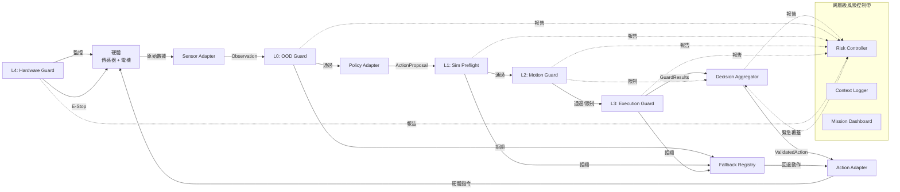
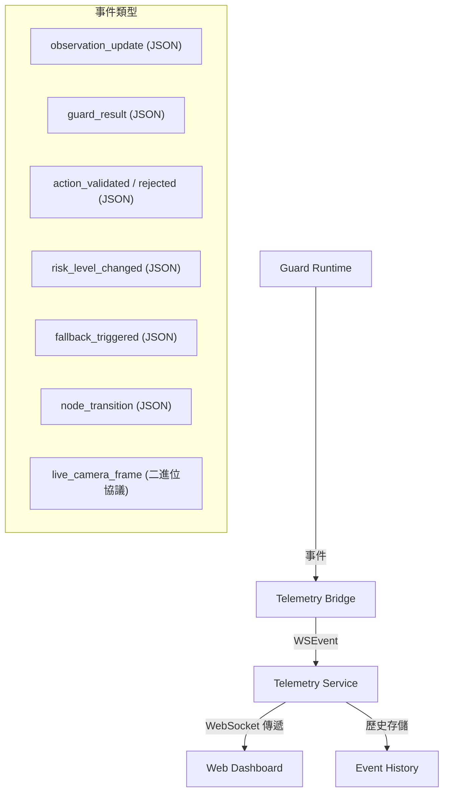
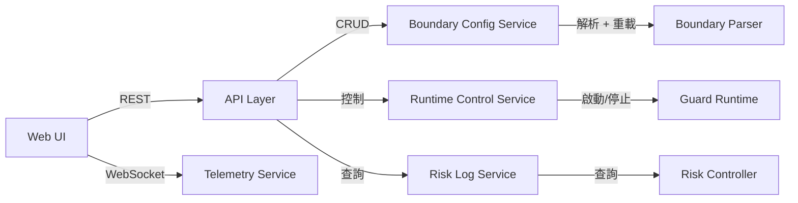

# DAM 架構參考手冊 (DAM Architecture Reference)

> **DAM: Detachable Action Monitor** (可拆卸動作監視器)
> 重構架構參考 · 2026 年 4 月

---

## 目錄 (Table of Contents)

- [詞彙表](#詞彙表-glossary)
0. [用戶導向總覽](#0-用戶導向總覽-user-facing-overview)
1. [核心組件](#1-核心組件-core-components)
2. [技術棧](#2-技術棧-technology-stack)
3. [設計決策](#3-設計決策-design-decisions)
4. [通訊地圖](#4-通訊地圖-communication-map)
5. [接口合約與基礎設施層](#5-接口合約與基礎設施層-interface-contract--infrastructure-layer)
6. [Stackfile 參考](#6-stackfile-參考-stackfile-reference)
7. [語法糖參考](#7-語法糖參考-syntax-sugar-reference)
8. [執行管線 (Pipeline)](#8-執行管線-pipeline)
9. [組件深入導讀](#9-組件深入導讀-component-deep-dives)
10. [SDK 與外部 API 依賴](#10-sdk--外部-api-依賴-sdk--external-api-dependencies)
11. [功能實現對照表](#11-功能實現對照表-function-implementation-table)
12. [測試策略](#12-測試策略-testing-strategy)
13. [開發路線圖](#13-開發路線圖-development-roadmap)

---

## 詞彙表 (Glossary)

按架構角色分類並按重要性排序的所有 DAM 特定術語參考。

### 1. 核心架構 (Core Architecture)
| 術語 | 定義 |
| :--- | :--- |
| **DAM** | **Detachable Action Monitor**（可拆卸動作監視器）—— 框架名稱。位居策略與硬體之間，作為一個可移除的安全層，無需修改策略權重或驅動程式碼。 |
| **Runner** | DAM 入口類。包裝 `PolicyAdapter.predict()` 和守衛棧；提供 `step(obs)` / `run()` 循環。用戶使用 Stackfile 路徑實例化 Runner。 |
| **Stackfile** | DAM 部署的主要 YAML 配置文件。聲明硬體佈線、守衛配置文件、模擬配置及靜態參數。 |
| **Control Plane** | **控制平面**（Python 層）：守衛邏輯、邊界評估、適配器協調以及策略/模擬器接口。 |
| **Data Plane** | **數據平面**（Rust 層）：高性能總線、RiskController 及硬體 I/O。繞過 Python GIL 以實現確定性的吞吐量。 |
| **Task** | 主要運行時實體。具有名稱、關聯的 `BoundaryContainer` 和生命週期（`start` / `stop`）。一個進程可運行多個任務。 |

### 2. 執行管線 (Execution Pipeline)
| 術語 | 定義 |
| :--- | :--- |
| **Stage DAG** | 有向無環圖，將守衛組織為併行或順序執行的階段（例如：L0 閘門 → L2 ‖ L1 → L3）。 |
| **CycleResult** | `dam.step()` 返回的豐富結果值。包含 `validated_action`、`guard_results`、`latency_ms` 和 `risk_level`。用於獎勵塑形。 |
| **ActionProposal** | 策略模型發出的原始動作張量。尚未經過驗證；可能會被守衛限制（clamped）或拒絕。 |
| **ValidatedAction** | 通過所有活動守衛（可能已被修改）的動作。交付至 `SinkAdapter` 進行硬體調度。 |
| **Observation** | 每週期通過 `ObservationBus` 交付給守衛的傳感器狀態結構化快照。在一個週期內是不可變的。 |
| **DecisionAggregator** | 階段 DAG 的最終階段。將 `GuardResult` 投票合併為單一的 `Decision` (PASS / CLAMP / REJECT / FAULT)。 |
| **Decision** | 聚合器的列舉輸出。驅動最終的動作派發或回退鏈。 |

### 3. 安全與執行 (Safety & Enforcement)
| 術語 | 定義 |
| :--- | :--- |
| **Guard** | 使用 `@dam.guard` 裝飾並實現 `check(**kwargs) → GuardResult` 的 Python 類。安全邏輯的基本單位。 |
| **GuardProfile** | Stackfile 中聲明的具名守衛子集 + 執行模式。通過 `dam.use_profile()` 激活。 |
| **GuardLayer** | 守衛的邏輯分組：L0 (OOD), L1 (Sim), L2 (Motion), L3 (Execution), L4 (Hardware)。 |
| **GuardResult** | `guard.check()` 的返回類型。包含 `decision`、`reason` 以及可選的 `clamp_target`。 |
| **Boundary** | YAML 中定義的具名安全約束節點。邊界與 Python 回調函數之間為 M:N 映射關係。 |
| **Enforcement Mode** | **執行模式**：每個配置文件的策略：`enforce`（封鎖不安全動作）、`monitor`（僅記錄）或 `log_only`（靜默）。 |
| **RiskLevel** | `RiskController` 產生的評分：`NOMINAL`、`ELEVATED`、`CRITICAL`。包含在 `CycleResult` 中。 |
| **Fallback Strategy** | 當守衛拒絕提案時採取的用戶定義動作（例如：`stop`、`hold_position`）。 |
| **Fault** | 表示在 `guard.check()` 期間發生異常或超時。在故障安全語義下視為 REJECT。 |
| **E-Stop** | 緊急停止（Emergency Stop）。當風險等級為 CRITICAL 或看門狗超時時觸發的硬體級停止。 |

### 4. 系統基礎設施 (System Infrastructure)
| 術語 | 定義 |
| :--- | :--- |
| **ObservationBus** | Rust 環形緩衝區，攝取原始傳感器數據並為守衛原子化成像。 |
| **ActionBus** | Rust 通道，將動作從 Python 傳輸至硬體。將輸出與執行解耦。 |
| **MetricBus** | 每週期遙測（延遲、風險評分）的 Rust 通道。由 `RiskController` 進行聚合。 |
| **NodeBus** | Rust 端發佈/訂閱路由，用於進程內守衛間通訊。 |
| **InjectionPool** | 合併了運行時池（obs, cycle_id 等）和配置池（靜態參數）的字典，用於填充守衛參數。 |
| **PolicyAdapter** | 包裝策略模型的用戶類。公共介面：`predict(obs) → ActionProposal`。 |
| **SimulatorAdapter** | 包裝物理模擬器的用戶類，供 L1 模擬預檢使用。 |
| **Source/Sink Adapter** | 負責攝取原始傳感器數據或將驗證後的動作交付至硬體（ROS2, CAN 等）的類。 |
| **Lookahead** | L1 使用的機制，在影子線程上提前一個週期在模擬中評估提案動作。 |
| **MCAP** | 用於 ObservationBus 持久化和違規上下文捕獲的二進制日誌格式。 |
| **WatchdogTimer** | Rust 硬體定時器，若控制循環超過其 `cycle_budget_ms` 則觸發 E-Stop。 |
| **PyO3** | 用於將 Rust 數據平面組件暴露給 Python 控制平面的 Rust–Python FFI 庫。 |

---

## 0. 用戶導向總覽 (User-Facing Overview)

DAM 位於您的策略與硬體之間，作為一個**可拆卸的安全層**。您可以將其附加到任何機器人設置上，而無需修改策略權重、訓練管線或現有的驅動程式碼。

### 您需要定義什麼 (What You Define)

DAM 用戶分為三個層次，各層次累加——進階層包含所有基礎層的內容。

**第一層 — 最小用戶（僅 YAML）**

| 項目 | 方式 | 位置 |
| :--- | :--- | :--- |
| **硬體數據源** | 聲明 Topic / 端口 / 驅動 | Stackfile `hardware.sources` |
| **硬體數據接收端** | 聲明 Topic / 端口 / 驅動 | Stackfile `hardware.sinks` |
| **策略** | 聲明類型 + 預訓練模型路徑 | Stackfile `policy` |
| **內建守衛** | 啟用 / 調整超參數 | Stackfile `guards.builtin` |
| **安全邊界** | 編寫 YAML 節點 + 內建約束條件 | Stackfile `boundaries` |
| **任務** | 聲明名稱 + 激活哪些邊界 | Stackfile `tasks` |

無需任何 Python 檔案。執行：`dam run --stack stackfile.yaml --task <name>`

**第二層 — 基礎用戶（YAML + Python 回調）**

| 項目 | 方式 | 位置 |
| :--- | :--- | :--- |
| **自定義約束檢查** | Python 函數 + `@dam.callback` | 您的 Python 檔案 |
| **自定義回退策略** | Python 類 + `@dam.fallback` | 您的 Python 檔案 |

在邊界節點的 `callback: [fn_name]` 中引用回調。

**第三層 — 進階用戶（YAML + 自定義 Adapter / Guard）**

| 項目 | 方式 | 位置 |
| :--- | :--- | :--- |
| **自定義守衛** | Python 類 + `@dam.guard(layer=…)` | 您的 Python 檔案 |
| **自定義 Source / Sink 類型** | Python 類 + `@dam.source_type` | 您的 Python 檔案 |
| **自定義 Policy Adapter** | Python 類 + `@dam.policy_type` | 您的 Python 檔案 |
| **自定義 Simulator Adapter** | 繼承 `SimulatorAdapter` 的 Python 類 | 您的 Python 檔案 |

### DAM 自動提供什麼 (What DAM Provides Automatically)

除此之外的一切——您無需編寫以下內容：

- 控制循環（託管模式或被動步進模式）
- 硬體連接生命週期（連接 / 斷開 / 重連）
- 每週期的全數據源觀測快照組裝
- 守衛管線編排（Stage DAG，並行執行）
- 決策聚合（REJECT > CLAMP > PASS）
- 回退升級鏈 (Fallback escalation chain)
- 風險控制器（Rust 中的窗口化指標聚合）
- 硬體 E-Stop（Rust 實現，獨立於 Python GIL）
- MCAP 循環緩衝區（在違規時自動捕捉前後 30 秒上下文）
- 邊界與回調的熱重載 (Hot reload)
- WebSocket 遙測與 REST API
- 分佈式追蹤 (每個週期傳遞 trace_id)

### 執行流程總覽 (Coarse-Grained Runtime Flow)

```
 ┌─────────────────────────────────────────────────────────────┐
 │  定義 (離線)                                                 │
 │  Stackfile YAML  +  Python 回調 / 自定義守衛                │
 └────────────────────────────┬────────────────────────────────┘
                              │  dam run --stack stackfile.yaml
 ┌────────────────────────────▼────────────────────────────────┐
 │  連接                                                       │
 │  DAM 自動佈線：Sources → ObservationBus                    │
 │                Sinks   ← ActionBus                             │
 │                策略與模擬器載入並注入                       │
 └────────────────────────────┬────────────────────────────────┘
                              │  dam.start_task("pick_and_place")
 ┌────────────────────────────▼────────────────────────────────┐
 │  執行 (每週期，默認 50 Hz)                                   │
 │  感知(Sense) → [L0 閘門] → 思考(Think) → [L1‥L3 驗證] → 行動│
 │                              └─ L4 硬體監控 (異步)          │
 └────────────────────────────┬────────────────────────────────┘
                              │  守衛返回 REJECT
 ┌────────────────────────────▼────────────────────────────────┐
 │  監控 / 反應                                                │
 │  風險控制器更新風險等級                                     │
 │  執行回退升級鏈                                             │
 │  捕捉 MCAP 上下文快照 (違規前後 ±30 秒)                      │
 │  遙測數據推送到儀表板                                       │
 └─────────────────────────────────────────────────────────────┘
```

### 最小用戶程式碼

**第一層 — 純 YAML，無需任何 Python：**
```bash
dam run --stack stackfile.yaml --task pick_and_place
```

**第二層 — 加入自定義約束檢查：**
```python
# callbacks.py

import dam

@dam.callback("check_grasp_force")
def check_grasp_force(obs, max_force_n: float) -> bool:
    return float(obs.force_torque[2]) < max_force_n
```
```bash
dam run --stack stackfile.yaml --task pick_and_place --python callbacks.py
```

**在執行點切換任務（Python 入口）：**
```python
# Task 無需 Python 類別定義 — 完全在 YAML 中聲明。
# Python 端只需呼叫生命週期 API：

runner = dam.Runner("stackfile.yaml")
runner.start_task("pick_and_place")   # 激活 YAML 中定義的邊界清單
# ... 執行循環 ...
runner.stop_task()
runner.start_task("sorting_box")      # 切換到另一組邊界
```

```bash
# 終端機
dam run --stack stackfile.yaml --task pick_and_place
```

其餘的一切——硬體連接、策略推理、守衛管線、回退、遙測——都由 DAM 透過 Stackfile 處理。

---

## 1. 核心組件 (Core Components)

DAM 的模組分為兩個截然不同的職責：**核心守衛邏輯**（安全決策）與**基礎設施/工具**（集成膠水）。保持這種職責分離至關重要——基礎設施模組是策略無關和硬體無關的包裝器；只有守衛模組承載安全語義。

> 基礎設施模組（適配器、解析器）定義在 [§5 接口合約與基礎設施層](#5-接口合約與基礎設施層-interface-contract--infrastructure-layer)。

### 1.1 核心守衛邏輯

具備**安全決策權**的 7 個模組，分佈於 5 個層級以及一個跨層級的風險控制帶。

| 模組 | 層級 | 角色 |
| :--- | :--- | :--- |
| **Guard Runtime** | 核心 | 編排所有守衛、聚合決策並分發 |
| **OOD Guard** | L0 | 拒絕分佈外觀測值（使用 Autoencoder） |
| **Simulation Preflight Guard** | L1 | 在模擬器中預執行動作以檢測碰撞 |
| **Motion Guard** | L2 | 強制執行關節限制、速度、加速度與工作空間邊界 |
| **Execution Guard** | L3 | 監控邊界容器約束 + 節點超時 |
| **Hardware Guard** | L4 | 監控電流、溫度；觸發硬體 E-Stop |
| **Risk Controller** | 跨層級 | 窗口化風險追蹤，全局緊急覆蓋 |

### 輔助模組

| 模組 | 角色 |
| :--- | :--- |
| **Decision Aggregator** | 合併多個 `GuardResult` → 最終的 PASS / CLAMP / REJECT |
| **Callback Registry** | Python 邊界檢查函數的中央存儲（M:N 映射） |
| **Fallback Registry** | 帶有自動升級機制的回退策略中央存儲 |
| **Telemetry Service** | 基於 WebSocket 的實時事件流 |
| **Boundary Config Service** | 用於邊界容器管理的基本 REST CRUD |
| **Runtime Control Service** | 用於啟動/暫停/恢復/停止/緊急停止的 REST API |
| **Risk Log Service** | 查詢歷史風險事件，導出上下文數據集 |
| **Context Logger** | 在每次違規時捕捉前後 30 秒的 MCAP 上下文快照 |

---

## 2. 技術棧 (Technology Stack)

### 2.1 控制平面 (Control Plane - Python)

| 類別 | 技術 | 用途 |
| :--- | :--- | :--- |
| **核心語言** | Python 3.10+ | 守衛邏輯、適配器、邊界定義、回退策略 |
| **配置文件** | YAML (Stackfile) | 守衛參數、邊界定義、任務映射、節點圖 |
| **回調系統** | Python 可調用對象 + `inspect` | 自動注入的邊界檢查函數、切換條件 |
| **中間件** | ROS 2 (可選) | 傳感器 Topic、動作服務器 —— 在 Stackfile 中聲明為 Sources/Sinks |
| **模擬** | Isaac Sim, Gazebo | 通過 SimulatorAdapter 實現 L1 模擬預檢前瞻 (Lookahead) |
| **OOD 檢測** | Autoencoder (PyTorch) | 基於重構誤差的異常檢測 |
| **策略推理** | PyTorch / ONNX | LeRobot ACT, Diffusion Policy, VLA, RL 代理 —— 通過 PolicyAdapter 包裝 |
| **API (REST)** | FastAPI / Flask | 邊界 CRUD、運行時控制、風險日誌 |
| **二進位協議 (Binary Protocol)** | 遙測服務 | 用於實時圖傳的高性能協議，格式為 `[0x01][NameLen][Name][JPEG]`，大幅降低 CPU 開銷。 |
| **CycleRecord 同步** | 資料流 | 每個週期記錄均包含 `active_cameras`，確保 MCAP 日誌與實時遙測元數據完全一致。 |
| **類型合約** | Python `dataclass` + `ABC` | 在模組邊界處強制執行 |

### 2.2 數據平面 (Data Plane - Rust + PyO3)

| 模組 | 技術 | 用途 |
| :--- | :--- | :--- |
| **ObservationBus** | Rust + PyO3 + MCAP | 基於 MCAP 的無鎖環形緩衝區；Python 守衛通過 PyO3 提取快照；L1 前瞻從 MCAP 重放 |
| **ActionBus** | Rust + PyO3 | 回退策略通過 PyO3 將 `ValidatedAction` 寫入硬體隊列 |
| **MetricBus** | Rust + PyO3 | 每個守衛專屬的 SPSC 通道；Python 在每次檢查後推播 `GuardResult` 摘要 |
| **E-Stop 信號** | Rust (原生) | 獨立於 Python GIL 的硬體級停止，由 Rust 觸發 |

---

## 3. 設計決策 (Design Decisions)

### 3.1 確定性安全重於概率性輸出
神經網絡策略產生的是概率性的動作提案 (Action Proposal)。DAM 保證分發到硬體的每一個動作都經過顯示邊界規則的**確定性驗證** —— 框架從不僅僅依賴模型信心度。

### 3.2 非侵入式集成 (適配器模式)
框架通過**三個適配器**（傳感器 / 策略 / 動作）包裝現有策略，無需觸及模型權重、程式碼或訓練管線。從模擬切換到真實硬體只需更換傳感器和動作適配器；策略適配器保持不變。

### 3.3 邊界作為一等公民 (M:N 映射)
安全規則在 YAML 中定義；邏輯在 Python 回調中實現。
關係是**多對多 (Many-to-Many)**：一個回調可以在多個 YAML 節點中重複使用，一個節點也可以引用多個回調。這實現了結構與邏輯的解耦，並最大化了重用性。

```
 YAML 節點                     Python 回調
┌──────────────┐         ┌────────────────────────┐
│ approach     │────────▶│ check_joint_position_limits()   │◀── global_safety
│ grasp        │──┐      ├────────────────────────┤
│ lift         │──┼─────▶│ check_workspace()      │◀── assembly
└──────────────┘  └─────▶│ check_velocity()       │◀── orient nodes
                         └────────────────────────┘
              M : N
```

### 3.4 邊界容器架構 (節點 → 列表 → 圖)
所有邊界都在**邊界容器 (Boundary Container)** 中組織，具備三個層級的複雜度：

| 容器類型 | 用例 | 切換邏輯 |
| :--- | :--- | :--- |
| **SingleNodeContainer** | 全局安全約束 | 無切換 |
| **ListContainer** | 線性順序任務 (Pick & Place) | 有序切換 |
| **GraphContainer** | 分支任務 (條件組裝) | 基於優先級，支持循環 |

每個容器都有一個單一入口點。系統在每個控制週期步進時評估約束和切換條件。

### 3.5 統一節點原則 (硬體封裝)
物理硬體實體（電機、手臂）被封裝為單一的**節點 (Node)** 實例。`傳感器適配器`（讀）和`動作適配器`（寫）共享每個節點的相同通訊接口。這可以：
- 防止多進程資源衝突
- 消除讀寫路徑之間的狀態分歧
- 直接映射到 ROS 節點/Topic 模型

```
┌──────────────────────────────────────────────┐
│            硬體節點 (統一)                     │
│  ┌─────────────────┐  ┌──────────────────┐   │
│  │ 觀測接口(Read)    │  │  動作接口(Write)   │   │
│  │   read_state()   │  │ apply_action()   │   │
│  └─────────────────┘  └──────────────────┘   │
│         [ 驅動: Serial / CAN / ROS ]          │
└──────────────────────────────────────────────┘
       ▲ 傳感器適配器讀取           ▲ 動作適配器寫入
```

### 3.6 分層守衛架構 (L0–L4)
守衛被組織在 5 個層級中，從 L0（感知）到 L4（硬體）順序執行。如果 L4 發出 REJECT，它會立即**短路** —— 因為硬體級別的危險是絕對的，無需進行進一步檢查。

### 3.7 決策聚合：REJECT > CLAMP > PASS
所有守衛結果由**優先級決策聚合器**合併：
- 任何 REJECT → 最終 REJECT (高層級 REJECT 優先)
- 無 REJECT 但有任何 CLAMP → 最終 CLAMP (應用限制後的動作)
- 全部 PASS → 最終 PASS

### 3.8 回退升級鏈
每個回退策略都聲明了自己的 `escalation_target`（升級目標）。執行失敗時，註冊表會自動沿鏈條升級。所有鏈條最終都會收斂到 `emergency_stop`（緊急停止）這一不可撤銷的終端狀態。

```
gentle_release ──失敗──▶ return_to_home ──失敗──▶ emergency_stop
hold_position  ──失敗──▶ return_to_home ──失敗──▶ emergency_stop
reverse_motion ──失敗──▶ hold_position  ──失敗──▶ return_to_home ──▶ emergency_stop
human_takeover ──超時──▶ return_to_home ──失敗──▶ emergency_stop
switch_policy  ──失敗──▶ return_to_home ──失敗──▶ emergency_stop
```

### 3.9 雙棧架構：控制平面 (Python) + 數據平面 (Rust)
Python 承載安全決策語義；Rust 承載實時數據吞吐。邊界由 PyO3 綁定強制執行，僅暴露類型化的、可序列化的接口 —— 守衛絕不直接導入具體的 Rust 結構體。

```
┌──────────────────────────────────────────────────────────┐
│               控制平面 (Control Plane - Python)           │
│  守衛邏輯 · 邊界定義 · 策略推理                              │
│  適配器格式轉換 · 回退策略邏輯                               │
└────────────────────┬─────────────────────────────────────┘
                     │  PyO3 綁定 (類型化讀/寫 API)
┌────────────────────▼─────────────────────────────────────┐
│                數據平面 (Data Plane - Rust)              │
│  ObservationBus · ActionBus · MetricBus · NodeBus        │
│  RiskController · WatchdogTimer · 硬體 I/O · E-Stop      │
└──────────────────────────────────────────────────────────┘
```

Python 在每週期恰好有三個點與數據平面交互：
1. **Pull (拉取)** — 從 ObservationBus 讀取 `Observation` 快照
2. **Push (推播)** — 在每次守衛檢查後向 MetricBus 寫入 `GuardResult` 摘要
3. **Write (寫入)** （僅回退時）— 向 ActionBus 寫入 `ValidatedAction`

### 3.10 基於裝飾器的註冊與雙重注入池
所有用戶面向的模組都通過 Python 裝飾器註冊。框架在導入時通過檢查函數簽名 (`inspect.signature`) 來解析依賴項。未知的參數名稱會在註冊時（而非運行時）拋出 `ValueError`。

每週期合併兩個獨立的注入池（名稱衝突時運行時池優先）：

| 池 | 來源 | 更新頻率 | 示例鍵 |
| :--- | :--- | :--- | :--- |
| **運行時池** | Rust ObservationBus / 週期泵 | 每週期 | `obs`, `action`, `node_bus`, `cycle_id`, `trace_id`, `timestamp` |
| **配置池** | YAML Stackfile `params:` 區塊 | 加載/熱重載時 | `upper_limits`, `max_velocity`, `force_threshold` 等 |

在**啟動 / 熱重載**時，框架對每個守衛執行一次預分割，而非在每個週期合併兩個池：

```python
# ── 啟動 / 熱重載：每個守衛只執行一次 ──────────────────────────────────────
for guard in active_guards:
    sig_keys = guard._cached_param_names          # 由 @dam.guard 在導入時儲存
    guard._static_kwargs = {k: config_pool[k]     # 凍結；永不在每週期重建
                            for k in sig_keys if k in config_pool}
    guard._runtime_keys  = [k for k in sig_keys   # 每週期只查找這些鍵
                            if k in RUNTIME_POOL_KEYS]

# ── 每週期熱路徑：2–4 次 dict 查找，無解析，無合併 ─────────────────────────
runtime_kwargs = {k: runtime_pool[k] for k in guard._runtime_keys}
result = guard.check(**guard._static_kwargs, **runtime_kwargs)
```

配置池鍵（來自 Stackfile `params:`）在啟動時存入 `_static_kwargs`（凍結字典），永不在每週期重建。運行時池鍵（`obs`、`action`、`cycle_id` 等）僅在 `_runtime_keys` 中列出，每週期只需 2–4 次字典查找。

跨進程守衛 (`process_group=`) 只能引用配置池中的鍵（可序列化原語）。運行時池對象通過共享內存傳遞，而非 pickle。

### 3.11 雙模式入口點

| 模式 | API | 用例 |
| :--- | :--- | :--- |
| **被動模式 (手動步進)** | `dam.step()` | ROS2 `timer_callback`、LeRobot 控制循環 —— 用戶擁有外部循環 |
| **託管模式 (託管循環)** | `dam.run()` | 獨立部署 —— 框架擁有一條高優先級線程 |

在兩種模式下，傳感器適配器都會在後台異步更新 `latest_obs`。`step()` / 託管循環始終拉取最新的可用快照 —— 它絕不會阻塞等待適配器。陳舊數據檢測使用 `timestamp` 與可配置的 `max_obs_age_sec` 進行對比。

### 3.12 故障即拒絕 (Fail-to-Reject) 安全保證
框架將每個 `guard.check()` 調用都包裝在 `try / except` 中。任何未處理的異常都會產生 `GuardResult.fault()`。故障在決策聚合器中被視為 `REJECT`，並觸發升級鏈。

遙測日誌會區分故障來源：

| 日誌欄位 `fault_source` | 意義 |
| :--- | :--- |
| `"environment"` | OOD / 硬體異常 —— 預期的安全條件 |
| `"guard_code"` | 用戶 `check()` 中的異常 —— 表示程式碼 Bug |
| `"timeout"` | WatchdogTimer 逾時 —— 守衛超過了週期預算 |

這讓操作員能將「機器人處於危險狀態」與「安全程式碼本身損壞」分開。

### 3.13 任務生命週期與配置驅動的邊界映射
任務 (Task) 是主要實體。每個任務聲明哪個邊界容器管轄它，以及如果找不到匹配項會發生什麼。

```yaml
# stackfile.yaml
tasks:
  pick_and_place:
    primary_boundary: pick_place_v1
    fallback_boundary: default_safety_envelope
  sorting_box:
    primary_boundary: sort_box_v2
    fallback_boundary: default_safety_envelope
```

`dam.start_task("pick_and_place")` 執行 O(1) 查找，在邊界調度器中激活 `pick_place_v1`，並凍結所有其他容器。如果找不到匹配任務，系統會立即進入最嚴格的安全停止狀態 —— 它絕不會在沒有已知邊界上下文的情況下運行。

```python
dam.start_task("pick_and_place")
dam.pause_task()
dam.resume_task()
dam.stop_task()   # → 安全停止，邊界停用
```

### 3.14 階段 DAG：有序 + 併行守衛執行
守衛被組織成具有明確依賴關係的執行階段。在一個階段內，守衛併行運行（獨立線程或進程）；在多個階段之間，執行是有序的。

```
[階段 0]  從 ObservationBus 拉取觀測值快照
               │
[階段 1]  L0 OOD 守衛                       ← 同步閘門；REJECT 會短路中斷
               │ 通過
[階段 2]  L2 運動學 ║ L1 模擬預檢 (異步前瞻影子線程)
               │ L2 輸出: 限制後的動作或原始動作
[階段 3]  L3 執行守衛                       ← 消耗 L2 輸出，而非原始提案
               │
[階段 4]  決策聚合 (Decision Aggregation)   ← 收集階段 2+3；超時 → fault
               │
[階段 5]  通過 ActionBus 執行
[始終執行] L4 硬體守衛                       ← 獨立的異步監控，不在 DAG 中
```

L1 模擬預檢在帶有前瞻緩衝區的影子線程上運行。如果其結果在階段 4 截止日期前可用，則會被納入；否則將被標記為 `TIMEOUT` 並記錄到風險控制器，而不阻塞控制週期。

> **靜態加速注意事項：** 傳遞給 `@dam.guard(layer=…)` 的層字串（`"L0"`–`"L4"`）在裝飾時即轉換為 `GuardLayer(IntEnum)`，運行時永不比較字串。Stage DAG 在啟動時構建為 `list[list[Guard]]`——每週期執行是純列表迭代，無字串比較或動態查找。完整的靜態加速策略詳見 §3.19。

### 3.15 聲明式來源/接收端 —— DAM 擁有入口點
用戶無需編寫控制循環或 ROS2 節點。他們在 Stackfile 中聲明**數據來源 (Sources)** 和**驗證後動作的去向 (Sinks)**。DAM 在啟動時自動創建所有訂閱者、發佈者和硬體連接。

```
數據源  →  ObservationBus  →  守衛運行時  →  ActionBus  →  接收端
(聲明)      (Rust/MCAP)       (Python 守衛)    (Rust)       (聲明)
```

內置數據源類型：`ros2_topic`, `ros2_action`, `lerobot`, `serial`, `can`, `isaac_sim`, `custom`。每個數據源以其物理頻率向 ObservationBus 發佈；守衛運行時每週期讀取最新的可用快照。這實現了傳感器刷新率與控制循環頻率的解耦。

### 3.16 策略適配器僅負責預測；L1 編排策略 + 模擬器
策略適配器向系統其餘部分僅暴露一個接口：

```python
predict(obs: Observation) → ActionProposal
```

它接收規範化的 `Observation`（已由數據源從平台原始數據轉換而來），並且對模擬或守衛一無所知。所有平台特定的轉換都是適配器內部的。

**L1 模擬預檢守衛**是唯一一個同時引用 `PolicyAdapter` 和 `SimulatorAdapter` 的組件。它使用標準的 `predict()` 接口在模擬中執行多步前瞻 —— 策略適配器並不知道自己在模擬循環中被調用。這保持了策略適配器的單一職責，且可在不影響 L1 邏輯的情況下進行更換。

```python
L1 前瞻:
  sim_obs = current_obs
  for step in range(lookahead_steps):
      sim_obs  = simulator.step(current_action)   # SimulatorAdapter
      if simulator.has_collision(): → REJECT
      current_action = policy.predict(sim_obs)    # PolicyAdapter (接口不變)
```

`policy` 和 `simulator` 都通過運行時池注入到 L1 的 `check()` 中 —— L1 聲明它們作為參數，框架負責解析。

### 3.17 Runner 模式 — LeRobot 與 ROS2 作為庫適配器
DAM 不包裝 CLI 工具。相反，它提供直接使用各平台庫 API 的 **Runner 類**：

- `dam.LeRobotRunner(robot, policy, stack)` — 內部調用 `make_robot()`, `make_policy()`；用戶無需編寫控制循環
- `dam.ROS2Runner(node, stack)` — 在現有 ROS2 節節點內創建訂閱/發佈；通過定時器回調與 ROS2 執行器集成
- `dam.run(stack)` — 完全託管；DAM 擁有從硬體連接到動作分發的一切

在所有情況下，用戶的貢獻是 Stackfile（聲明式）以及可選的自定義守衛、回調和回退策略的 Python 類。控制循環、硬體生命週期和驗證管線始終由 DAM 擁有。

### 3.18 守衛配置文件 + 監控模式 (訓練支持)
DAM 支持三種**運行時執行模式**和**具名守衛配置文件**，以在不更改守衛程式碼的情況下涵蓋訓練、評估和生產部署。

**執行模式：**

| 模式 | 守衛管線 | 動作分發 | 用例 |
| :--- | :--- | :--- | :--- |
| `enforce` | 完整驗證 | `ValidatedAction` (限制或拒絕) | 生產部署 |
| `monitor` | 完整驗證 (運行但不阻塞) | 原始 `ActionProposal` 不變 | 策略評估、安全標註、基準違規率 |
| `log_only` | 運行守衛，記錄結果 | 原始 `ActionProposal` 不變 | 示範錄製期間的數據集標註 |

**具名配置文件 (Named Profiles)** 允許按場景使用不同的守衛子集，在 Stackfile 中聲明並在運行時選擇：

```yaml
profiles:
  training_rl:
    active_guards: [motion, hardware]   # 白名單；其他守衛完全跳過
    mode: enforce
    cycle_budget_ms: 5                     # 為快速 RL 循環提供緊湊延遲

  demo_recording:
    active_guards: [motion, execution]
    mode: log_only

  evaluation:
    active_guards: [ood, motion, execution, hardware]
    mode: monitor                          # 觀察完整管線，但不執行攔截
```

**`CycleResult` —— 針對訓練循環的增強型返回值：**

```python
@dataclass
class CycleResult:
    validated_action:   Optional[ValidatedAction]
    original_proposal:  ActionProposal
    was_clamped:        bool
    was_rejected:       bool
    guard_results:      List[GuardResult]       # 每個守衛的決策
    fallback_triggered: Optional[str]
    cycle_id:           int
    trace_id:           str
    latency_ms:         Dict[str, float]        # 每個階段的延遲細分
    risk_level:         RiskLevel

# 訓練腳本用法示例：
result = runner.step()
reward_penalty = -1.0 if result.was_clamped else 0.0   # 獎勵塑形
dataset.record(obs, result.original_proposal, safe=not result.was_rejected)
```

### 3.19 靜態加速：啟動預計算

DAM 在啟動（及熱重載）時儘可能多地預計算，使每週期熱路徑降至最低開銷。下表總結了各項目的計算時機與熱路徑成本：

| 項目 | 計算時機 | 熱路徑成本 |
| :--- | :--- | :--- |
| **簽名檢查** (`inspect.signature`) | 導入時（`@dam.guard` / `@dam.callback`） | 零——已快取為 `list[str]` |
| **GuardLayer IntEnum** | 裝飾時 | 零——整數比較 |
| **Stage DAG 拓撲** | 啟動時 | `list[list[Guard]]`——索引存取 |
| **`_static_kwargs`** | 啟動 / 熱重載時 | 凍結字典解包 |
| **`_runtime_keys`** | 啟動 / 熱重載時 | 2–4 次 dict 查找 |
| **約束值** | 啟動 / 熱重載時 | 原生 `float` / `np.ndarray` |
| **回退鏈** | 啟動時 | 物件指針鏈結串列 |
| **決策聚合** | 啟動時 | `max()` 對 IntEnum 操作 |

熱重載時，只有變更的區段需要重新解析；受影響守衛的 `_static_kwargs` 會在週期柵欄（cycle fence）處通過雙緩衝原子交換，不中斷正在執行的週期。

---

## 4. 通訊地圖 (Communication Map)

### 4.1 端到端數據流 (End-to-End Data Flow)



### 4.2 實時遙測拓撲 (Real-Time Telemetry Topology)



### 4.3 API 通訊 (API Communication)



---

## 5. 接口合約與基礎設施層 (Interface Contract & Infrastructure Layer)

### 5.0 基礎設施 / 工具層
這些模組是**集成膠水** —— 它們不承載任何安全決策權。其任務是在外部世界與 DAM 內部類型合約之間進行轉換。更換其中任何一個模組都絕不能影響守衛行為。在新的 Sources/Sinks 架構中，Sensor Adapter 和 Action Adapter 由 Stackfile 聲明自動實例化；用戶永不直接構造它們。

| 模組 | 類別 | 角色 |
| :--- | :--- | :--- |
| **Source Adapter** | 平台橋接 | 在 Stackfile 中聲明；從 ROS2 Topic / LeRobot / Serial / CAN 讀取 → `Observation` 欄位 |
| **Sink Adapter** | 平台橋接 | 在 Stackfile 中聲明；將 `ValidatedAction` 轉換為硬體指令 / ROS2 Topic |
| **Policy Adapter** | 模型橋接 | 包裝任何策略模型；僅暴露 `predict(obs) → ActionProposal` |
| **Simulator Adapter** | 模擬橋接 | 暴露 `step(action) → Observation` + `has_collision() → bool`；僅由 L1 使用 |
| **Boundary Config Parser** | 配置加載 | 將 YAML 解析為帶有回調綁定的 `BoundaryContainer` |
| **Fallback Strategies Parser** | 配置加載 | 加載並管理帶有升級鏈的回退策略 |
| **Stackfile Loader** | 配置加載 | 解析完整的 Stackfile YAML；啟動時佈線 Sources、Sinks、Guards、Tasks 與運行時 |

**設計原則：** 守衛絕不導入具體的適配器類 —— 它們僅在其 `check()` 簽名中聲明參數名稱。框架負責從運行時池中解析並注入正確的對象。這在導入級別強制執行了集成邏輯與安全邏輯之間的邊界。

**SimulatorAdapter 接口：**

```python
class SimulatorAdapter(ABC):
    def reset(self, obs: Observation) -> None: ...    # 將模擬與當前真實狀態同步
    def step(self, action: ActionProposal) -> Observation: ...
    def has_collision(self) -> bool: ...
    def is_available(self) -> bool: ...               # 如果返回 False，L1 會優雅跳過
```

---

### 5.1 數據類型 (Data Types)

```python
@dataclass
class Observation:
    timestamp: float                          # 秒
    joint_positions: np.ndarray               # [rad]
    joint_velocities: Optional[np.ndarray]    # [rad/s]
    end_effector_pose: Optional[np.ndarray]   # [x,y,z,qx,qy,qz,qw]
    force_torque: Optional[np.ndarray]        # [Fx,Fy,Fz,Tx,Ty,Tz]
    images: Optional[Dict[str, np.ndarray]]   # {"camera_name": 圖像數組}
    metadata: Dict[str, Any]

@dataclass
class ActionProposal:
    timestamp: float
    target_joint_positions: np.ndarray        # [rad]
    target_joint_velocities: Optional[np.ndarray]
    target_ee_pose: Optional[np.ndarray]      # 用於 IK
    gripper_action: Optional[float]           # 0.0=關閉, 1.0=打開
    confidence: float                         # [0.0 ~ 1.0]
    policy_name: str
    metadata: Dict[str, Any]

@dataclass
class ValidatedAction:
    timestamp: float
    target_joint_positions: np.ndarray
    target_joint_velocities: Optional[np.ndarray]
    gripper_action: Optional[float]
    was_clamped: bool
    original_proposal: Optional[ActionProposal]

class Decision(Enum):
    PASS = "pass"
    CLAMP = "clamp"
    REJECT = "reject"

@dataclass
class GuardResult:
    decision: Decision
    guard_name: str
    layer: str                                # "L0" ~ "L4"
    reason: str
    clamped_action: Optional[ValidatedAction]
    metadata: Dict[str, Any]
```

### 5.2 適配器接口 (Adapter Interfaces)

| 介面 | 方法 | 輸入 → 輸出 |
| :--- | :--- | :--- |
| **SensorAdapter** | `connect()`, `read()`, `is_healthy()`, `disconnect()` | 原始硬體 → `Observation` |
| **PolicyAdapter** | `initialize(config)`, `predict(obs)`, `get_policy_name()`, `reset()` | `Observation` → `ActionProposal` |
| **ActionAdapter** | `connect()`, `apply(action)`, `emergency_stop()`, `get_hardware_status()`, `disconnect()` | `ValidatedAction` → 硬體 |

### 5.3 守衛接口 (Guard Interface)

```python
class Guard(ABC):
    def get_layer(self) -> str: ...           # "L0" ~ "L4"
    def get_name(self) -> str: ...
    def check(self, observation, action) -> GuardResult: ...
    def on_violation(self, result) -> None: ...
```

### 5.4 邊界容器接口 (Boundary Container Interface)

```python
class BoundaryContainer(ABC):
    def get_active_node(self) -> BoundaryNode: ...
    def evaluate(self, observation, action) -> GuardResult: ...
    def advance(self, observation) -> Optional[str]: ...  # 返回下一個節點 ID
    def reset(self) -> None: ...
    def get_all_nodes(self) -> List[BoundaryNode]: ...
```

### 5.5 回退策略接口 (Fallback Strategy Interface)

```python
class Fallback(ABC):
    def get_name(self) -> str: ...
    def execute(self, context: FallbackContext, action_adapter) -> FallbackResult: ...
    def get_escalation_target(self) -> Optional[str]: ...  # None = 終端
    def get_description(self) -> str: ...
```

### 5.6 運行時服務接口 (Runtime Service Interfaces)

| 服務 | 協議 | 關鍵端點 (Key Endpoints) |
| :--- | :--- | :--- |
| **BoundaryConfigService** | REST | `GET/POST /api/boundaries`, `PUT/DELETE /api/boundaries/{id}`, `POST /api/boundaries/validate` |
| **RuntimeControlService** | REST | `GET /api/runtime/status`, `POST /api/runtime/{start,pause,resume,stop,emergency_stop}` |
| **TelemetryService** | WebSocket | 訂閱/取消訂閱事件, 發佈事件, `GET /api/telemetry/history` |
---

## 6. Stackfile 參考 (Stackfile Reference)

**Stackfile** (`.dam_stackfile.yaml`) 是 DAM 部署的**唯一配置入口點**。不需要 Python 入口點 —— `dam run --stack .dam_stackfile.yaml` 即可引導整個系統。所有硬體連接、守衛註冊、任務生命週期與運行時參數都在此處聲明。

```yaml
# .dam_stackfile.yaml — 完整註釋範例 (so101 + LeRobot + ROS2 混合模式)

version: "1"

# ── 硬體預設 (Hardware Preset) ───────────────────────────────────────────────
# 關節名稱、限制與標定均從預設繼承。
# 僅聲明覆蓋項。
hardware:
  preset: so101_follower
  joints:                          # 可選：僅覆蓋特定關節
    wrist_roll:
      limits_rad: [-2.74, 2.84]   # 來自您自己的標定輸出

  # Sources：觀測數據的來源。
  # DAM 在啟動時自動訂閱/讀取。用戶僅需聲明，無需實現。
  sources:
    joint_states:
      type: ros2_topic
      topic: /joint_states
      msg_type: sensor_msgs/JointState
      mapping:
        position: obs.joint_positions
        velocity: obs.joint_velocities

    camera_top:
      type: ros2_topic
      topic: /camera/top/image_raw
      msg_type: sensor_msgs/Image
      mapping:
        data: obs.images.top

    follower_arm:                  # LeRobot 直接驅動 — 同時也是 Sink (雙向)
      type: lerobot
      port: /dev/tty.usbmodem5AA90244141
      id: my_awesome_follower_arm
      cameras:
        top:   { type: opencv, index: 0, width: 640, height: 480, fps: 30 }
        wrist: { type: opencv, index: 1, width: 640, height: 480, fps: 30 }

  # Sinks：驗證後的動作去向。
  sinks:
    follower_command:
      ref: sources.follower_arm    # 與 Source 使用同一個機器人實例
    joint_cmd_topic:
      type: ros2_topic
      topic: /arm_controller/command
      msg_type: trajectory_msgs/JointTrajectory
      mapping:
        action.target_joint_positions: positions

# ── 策略 (Policy) ─────────────────────────────────────────────────────────
policy:
  type: lerobot                    # 內建：LeRobotPolicyAdapter
  pretrained_path: MikeChenYZ/smolvla-isaac-mimic-v2
  device: mps                      # cpu | cuda | mps
  chunk_size: 10
  n_action_steps: 10

# ── 模擬 (Simulation) (可選 — 僅在啟用 L1 守衛時需要) ──────────────────────────
simulation:
  type: isaac_sim                  # gazebo | mujoco | custom
  preset: so101_follower           # 自動對齊關節定義與硬體
  scene: assets/pick_and_place.usd
  lookahead_steps: 10              # 通過 config_pool 注入 L1

# ── 守衛容器 (Custom Guards) ────────────────────────────────────────────────
# 特殊守衛：需在 Python 端通過 @dam.guard(layer="L3") 註冊。
# 核心守衛（運動學、工作空間等）請見下方 boundaries 區塊。
guards:
  custom:
    - class: GraspForceGuard
      params:
        max_force_n: 15.0

# ── 安全與運行時全局設定 ────────────────────────────────────────────────────────
safety:
  control_frequency_hz: 15
  no_task_behavior: emergency_stop
  enforcement_mode: log_only

# ── 邊界 (Boundaries) ────────────────────────────────────────────────────────
# 註解：每個 node 引用註冊名為 'callback' 的模板與註冊名為 'fallback' 的策略。
boundaries:
  workspace:
    type: single
    nodes:
      - node_id: default
        max_speed: 0.8
        callback: workspace
        timeout_sec: 1
        fallback: emergency_stop
        params:
          bounds: [[-0.4, 0.4], [-0.4, 0.4], [0.02, 0.6]]

  joint_position_limits:
    type: single
    nodes:
      - node_id: default
        max_speed: 0.8
        callback: joint_position_limits
        timeout_sec: 1
        fallback: emergency_stop
        params:
          upper: [2.9, 2.9, 2.9, 2.9, 2.9, 2.9]
          lower: [-2.9, -2.9, -2.9, -2.9, -2.9, -2.9]

# ── 任務 (Tasks) ────────────────────────────────────────────────────────────
# 任務決定了當前哪些邊界處於激活狀態。
tasks:
  default:
    description: "Simulation task"
    boundaries: [workspace, joint_position_limits]

# ── 運行時 (Runtime) ────────────────────────────────────────────────────────
runtime:
  mode: managed                    # managed = dam.run() 持有循環
  max_obs_age_sec: 0.1             # 觀測數據過期閾值
  cycle_budget_ms: 18              # 每個循環的 WatchdogTimer 截止時間

# ── 風險控制器 (Risk Controller) ─────────────────────────────────────────────
risk_controller:
  window_sec: 10.0
  clamp_threshold: 5
  reject_threshold: 2
```

### 注入池鍵位參考 (Injection Pool Keys Reference)

| 鍵名 | 池類型 | 數據類型 | 注入來源 |
| :--- | :--- | :--- | :--- |
| `obs` | Runtime | `Observation` | 每循環一次的 ObservationBus 快照 |
| `action` | Runtime | `ActionProposal` | PolicyAdapter.predict() 的輸出 |
| `policy` | Runtime | `PolicyAdapter` | 當前活動的策略實例 |
| `simulator` | Runtime | `SimulatorAdapter` | 活動模擬器實例 (未配置則為 None) |
| `node_bus` | Runtime | `NodeBus` | 跨節點觀測訂閱 |
| `cycle_id` | Runtime | `int` | 單調遞增循環計數器 |
| `trace_id` | Runtime | `str` | 每循環生成的 UUID，傳遞給所有守衛 |
| `timestamp` | Runtime | `float` | 循環牆鐘時間 (秒) |
| *(任何 `params` 鍵名)* | Config | 用戶定義 | 守衛自身的 Stackfile `params:` 區塊 |

---

## 7. 語法糖參考 (Syntax Sugar Reference)

擴展點均為 Python 裝飾器，自動處理註冊、生命週期與注入。**多數用戶只需要第二層裝飾器。**第三層僅供框架開發者與進階整合者使用。

### 7.1 裝飾器目錄 (Decorator Catalogue)

**第二層 — 基礎用戶**

| 裝飾器 | 應用對象 | 你實現什麼 | DAM 自動處理 |
| :--- | :--- | :--- | :--- |
| `@dam.callback("name")` | `def fn(**injected) → bool` | 函數體 | 注入解析、導入時簽名驗證 |
| `@dam.fallback(name, escalates_to)` | `class Foo(Fallback)` | `execute(ctx, bus) → FallbackResult` | 註冊表、升級鏈佈線 |

**第三層 — 進階用戶 / 開發者**

| 裝飾器 | 應用對象 | 你實現什麼 | DAM 自動處理 |
| :--- | :--- | :--- | :--- |
| `@dam.guard(layer, process_group)` | `class Foo(Guard)` | `check(**injected) → GuardResult` | 註冊、trace_id 注入、指標推送、錯誤包裝 |
| `@dam.source_type("name")` | `class Foo(SourceAdapter)` | `connect()`, `read_raw()`, `convert(raw) → dict` | 生命週期、線程安全 `latest_obs`、`is_healthy()` |
| `@dam.policy_type("name")` | `class Foo(PolicyAdapter)` | `initialize(cfg)`, `predict(obs) → ActionProposal` | 模型加載、設備分配、`reset()` |

### 7.2 第二層：Callback 注入規則

Callback 是基礎用戶的主要 Python 擴展點。DAM 在導入時檢查函數簽名，自動從 InjectionPool 注入對應參數——你只需聲明實際用到的參數。

```python
import dam

# ✅ 混合使用 runtime 鍵 (obs) 與 config 鍵 (max_force_n 來自 Stackfile params:)
@dam.callback("check_grasp_force")
def check_grasp_force(obs: Observation, max_force_n: float) -> bool:
    return float(obs.force_torque[2]) < max_force_n

# ✅ 只需要 runtime 鍵時，不必宣告 config 鍵
@dam.callback("check_workspace")
def check_workspace(obs: Observation, bounds: list) -> bool:
    pos = obs.end_effector_pose[:3]
    return all(bounds[i][0] <= pos[i] <= bounds[i][1] for i in range(3))

# ❌ 未知鍵名 → 導入時拋出 ValueError（非運行時）
@dam.callback("bad_cb")
def bad_cb(obs, typo_param) -> bool: ...
# ValueError: unknown injectable 'typo_param'
```

可注入的鍵值：`obs`、`action`、`cycle_id`、`trace_id`、`timestamp`、`node_bus`，以及 Stackfile `params:` 區塊中聲明的任意鍵。

### 7.3 第三層：自定義 Guard 開發

自定義 Guard 用於擴展守衛管線，僅在內建 L0–L4 守衛不足時使用。所有注入規則與 §7.2 相同——Guard 使用同一個 InjectionPool。

```python
import dam
from dam import Guard, GuardResult, Observation, ActionProposal

# 在 L3 層註冊自定義守衛
@dam.guard(layer="L3")
class GraspForceGuard(Guard):
    def check(self, obs: Observation, action: ActionProposal,
              max_force_n: float           # ← config_pool（來自 Stackfile params:）
              ) -> GuardResult:
        if obs.force_torque is not None and abs(obs.force_torque[2]) > max_force_n:
            return GuardResult.reject("grasp force exceeded")
        return GuardResult.pass_()

# 帶有完整模擬器訪問的 L1 守衛（框架內部範例）
@dam.guard(layer="L1")
class SimPreflightGuard(Guard):
    def check(self, obs, action,
              policy: PolicyAdapter,        # ← runtime_pool
              simulator: SimulatorAdapter,  # ← runtime_pool（未配置則為 None）
              lookahead_steps: int          # ← config_pool
              ) -> GuardResult: ...
```

在 Stackfile `guards.custom` 中聲明：
```yaml
guards:
  custom:
    - class: GraspForceGuard
      params:
        max_force_n: 15.0
```

## 8. 執行管線 (Pipeline)

### 8.1 循環泵 (The Cycle Pump)
1. **觸發 (Trigger)：** 定時器 (Managed) 或 `dam.step()` (Passive)。
2. **感知 (Sense)：** 從 ObservationBus 獲取帶有 `timestamp` 的最新原子快照。
3. **注入 (Inject)：** 組裝 InjectionPool (Runtime + Config 參數)。
4. **驗證 (Validate)：** 執行 Stage DAG。
    - L0 作為同步閘門（拒絕則短路）。
    - L1/L2 併行執行。
    - L3 消耗聚合後的 L2 輸出。
5. **分發 (Dispatch)：** 將 `ValidatedAction` 寫入 ActionBus。
6. **報告 (Report)：** 將決策摘要推送到 MetricBus 並更新風險等級。

### 8.2 異步 L1 前瞻 (L1 Lookahead)
L1 守衛運行在獨立線程上，使用當前觀測值、提議動作以及 `SimulatorAdapter` 預測 $N$ 步。若預測發生碰撞，L1 發出 REJECT。由於延遲，L1 可能會跨越一個控制週期。

---

## 9. 組件深入導讀 (Component Deep Dives)

### 9.1 RiskController (Rust)
維持一個帶有加權懲罰的滑動觀測窗口。
- **CLAMP** = 1 分
- **REJECT** = 5 分
- **FAULT** = 10 分
當窗口總分超過閾值時，強制將系統切換到 `CRITICAL` 風險等級並引發硬體 E-Stop。

### 9.2 ObservationBus (Rust)
基於 MCAP 磁盤支持的環形緩衝區。這允許：
- **歷史重放：** 守衛可以請求過往 2 秒的窗口數據。
- **離線調試：** 直接使用 `dam replay` 運行錄製的數據流進行策略驗證。

---

## 10. SDK 與外部 API 依賴 (SDK & External API Dependencies)

| 依賴 | 版本 | 用途 |
| :--- | :--- | :--- |
| **PyO3** | 0.20+ | Python/Rust 橋接 |
| **MCAP** | 最新 | 高性能日誌與緩衝 |
| **LeRobot** | 基座適配器與預先佈線 |
| **ROS2** | Humble/Iron | 分佈式 Sources/Sinks (自選) |
| **FastAPI** | 0.100+ | UI 後端與 REST 控制 |

---

## 11. 功能實現對照表 (Function Implementation Table)

所有必須實現的函數，按模組分組。**粗體** = 該組中其他函數可以測試之前必須存在的函數。

### 11.1 核心數據類型 (Core Data Types) (階段 1 — 優先凍結)

| 函數 / 類 | 簽名 | 備註 |
| :--- | :--- | :--- |
| `Observation` | `@dataclass` | timestamp, joint_positions, joint_velocities, end_effector_pose, force_torque, images, metadata |
| `ActionProposal` | `@dataclass` | timestamp, target_joint_positions, target_joint_velocities, gripper_action, confidence, policy_name, metadata |
| `ValidatedAction` | `@dataclass` | timestamp, target_joint_positions, target_joint_velocities, gripper_action, was_clamped, original_proposal |
| `GuardResult` | `@dataclass` | decision, guard_name, layer, reason, clamped_action, fault_source, metadata |
| `GuardResult.pass_()` | `() → GuardResult` | 工廠方法 |
| `GuardResult.reject(reason)` | `(str) → GuardResult` | 工廠方法 |
| `GuardResult.clamp(action)` | `(ValidatedAction) → GuardResult` | 工廠方法 |
| `GuardResult.fault(exc, source)` | `(Exception, str) → GuardResult` | source ∈ {environment, guard_code, timeout} |
| `Decision` | `Enum` | PASS, CLAMP, REJECT, FAULT |
| `RiskLevel` | `Enum` | NORMAL, ELEVATED, CRITICAL, EMERGENCY |
| **`CycleResult`** | `@dataclass` | 包含該循環的所有決策與性能指標 |

### 11.2 守衛 ABC 與 運行時 (Phase 1)

| 函數 | 簽名 | 備註 |
| :--- | :--- | :--- |
| **`Guard.check`** | `(**injected) → GuardResult` | ABC；框架會對其進行 try/except 封裝 |
| `Guard.get_layer` | `() → str` | 返回 "L0"–"L4" |
| `Guard.get_name` | `() → str` | 若未覆蓋則從類名自動衍生 |
| `Guard.on_violation` | `(GuardResult) → None` | 副作用鉤子 |
| **`DecisionAggregator.aggregate`** | `(List[GuardResult]) → GuardResult` | REJECT > CLAMP > PASS；最高層級拒絕勝出 |
| **`GuardRuntime.validate`** | `(obs, action) → ValidatedAction \| None` | 執行 Stage DAG；拒絕時返回 None |
| `GuardRuntime.step` | `() → CycleResult` | 一個完整的 感知→驗證→執行 循環 |
| `GuardRuntime.run` | `(task) → None` | 受管循環；阻塞執行 |
| `GuardRuntime.start_task` | `(name: str) → None` | O(1) 查找，激活邊界上下文 |
| `GuardRuntime.stop_task` | `() → None` | 安全停止，停用邊界 |

### 11.3 邊界系統 (Phase 1)

| 函數 | 簽名 | 備註 |
| :--- | :--- | :--- |
| **`BoundaryContainer.evaluate`** | `(obs, action) → GuardResult` | ABC |
| `BoundaryContainer.get_active_node` | `() → BoundaryNode` | |
| `BoundaryContainer.advance` | `(obs) → str \| None` | 返回下一個 node_id 或 None |
| `BoundaryContainer.reset` | `() → None` | |
| **`BoundaryContainer.snapshot`** | `() → dict` | 用於暫停/恢復的可序列化狀態 |
| **`BoundaryContainer.restore`** | `(dict) → None` | 從快照恢復 |
| `CallbackRegistry.register` | `(name, fn) → None` | 由 `@dam.callback` 在導入時調用 |
| `FallbackRegistry.register` | `(strategy) → None` | 由 `@dam.fallback` 調用 |
| `FallbackRegistry.execute_with_escalation` | `(name, ctx, bus) → FallbackResult` | 遵循升級鏈直到成功或 E-Stop |

### 11.4 注入系統 (Phase 1)

| 函數 | 簽名 | 備註 |
| :--- | :--- | :--- |
| **`InjectionResolver.register`** | `(fn, valid_keys) → None` | 導入時調用；遇到未知參數拋出 ValueError |
| `InjectionResolver.call` | `(fn, pool: dict) → Any` | 從合併後的池中解析 kwargs 並調用 fn |
| `InjectionResolver.build_pool` | `(runtime_pool, config_pool) → dict` | 發生衝突時 runtime 優先 |

### 11.5 適配器與運行器 (Phase 2)

| 函數 | 簽名 | 備註 |
| :--- | :--- | :--- |
| **`SourceAdapter.connect`** | `() → None` | ABC |
| `SourceAdapter.read_raw` | `() → Any` | ABC；在後台線程中調用 |
| **`SourceAdapter.convert`** | `(raw) → dict` | ABC；用戶實現；返回 obs 欄位字典 |
| **`PolicyAdapter.predict`** | `(obs: Observation) → ActionProposal` | ABC；唯一的公開介面 |
| `PolicyAdapter.initialize` | `(config: dict) → None` | |
| **`SimulatorAdapter.step`** | `(action: ActionProposal) → Observation` | ABC |
| `SimulatorAdapter.reset` | `(obs: Observation) → None` | 將模擬同步到真實狀態 |
| `LeRobotRunner.run` | `(task: str) → None` | 受管循環 |

### 11.6 Rust PyO3 介面 (Phase 2)

| 函數 | Python 可見簽名 | 備註 |
| :--- | :--- | :--- |
| **`ObservationBus.write`** | `(obs: Observation) → None` | 由 Source 適配器調用 |
| **`ObservationBus.read_latest`** | `() → Observation` | 由 Guard Runtime 每循環調用 |
| `ObservationBus.read_window` | `(duration_sec: float) → List[Observation]` | L1 前瞻重放 |
| **`ActionBus.send`** | `(action: ValidatedAction) → None` | 驗證通過/限制時由 Runtime 調用 |
| `ActionBus.emergency_stop` | `() → None` | 立即硬體停止 |
| **`MetricBus.push`** | `(summary: GuardResultSummary) → None` | 守衛 check() 後調用 |
| **`RiskController.is_emergency`** | `() → bool` | 每循環開始時檢查 (原子讀取) |
| `NodeBus.latest` | `(node_id: str) → Observation` | 跨節點訂閱 |

### 11.7 Stackfile 與 CLI (Phase 1–2)

| 函數 / 動作 | 備註 |
| :--- | :--- |
| `StackfileLoader.load(path)` | 解析 + 驗證；Schema 錯誤時拋出 |
| `StackfileLoader.validate(path)` | 僅執行試運行驗證；用於 `dam validate` |
| `dam run --stack --task` | 系統主入口點 |
| `dam validate --stack` | 部署前 Schema + 註冊檢查；不連接硬體 |
| `dam replay --mcap --stack` | 離線重放違規上下文進行管線調試 |

### 11.8 測試工具集 (Phase 1)

| 函數 | 備註 |
| :--- | :--- |
| `dam.testing.MockSourceAdapter(obs_sequence)` | 重放預錄製的 Observation 列表 |
| `dam.testing.MockPolicyAdapter(actions)` | 從固定列表返回動作 |
| `dam.testing.inject_and_call(fn, **pool)` | 使用顯式池調用守衛/回調；無需啟動運行時 |
| `dam.testing.assert_rejects(guard, obs, action, **cfg)` | 用於單元測試的一行式斷言 |
| `dam.testing.safety_regression(guard, scenarios)` | 批量運行已知危險場景；若有通過 (PASS) 則失敗 |

---

## 12. 測試策略 (Testing Strategy)

### 12.1 層級模型

| 層級 | 工具 | 範疇 | 執行時機 |
| :--- | :--- | :--- | :--- |
| **單元測試 (Unit)** | `pytest` + `inject_and_call` | 單個守衛或回調，無運行時 | 每次提交 |
| **管線集成 (Pipeline)** | `pytest` + `run_pipeline` | 完整守衛 DAG，模擬適配器 | 每次提交 |
| **安全回歸 (Safety)** | `safety_regression` | 已知危險場景必須始終觸發 REJECT | 每次提交；失敗則阻塞合併 |
| **硬體在環 (HIL)** | `pytest` + 仿真/真實機器人 | 真實硬體時序 | 發佈前 |
| **屬性/模糊測試** | `hypothesis` | 邊界條件、回調函數邊緣情形 | 每晚構建 |

### 12.2 單元測試模式

```python
from dam.testing import inject_and_call, assert_rejects, assert_clamps
from dam import MockObservation, MockActionProposal

def test_motion_guard_clamps_over_limit():
    guard = MotionGuard()
    obs = MockObservation(joint_positions=[0.0]*6)
    action = MockActionProposal(target_joint_positions=[2.0, 0, 0, 0, 0, 0])  # 超出 1.5 的限制
    assert_clamps(guard, obs, action, upper_limits=[1.5]*6, lower_limits=[-1.5]*6)

def test_motion_guard_rejects_workspace_breach():
    guard = MotionGuard()
    obs = MockObservation(end_effector_pose=[1.0, 1.0, 1.0, 0, 0, 0, 1])  # 超出邊界
    action = MockActionProposal(target_joint_positions=[0.5]*6)
    assert_rejects(guard, obs, action, bounds=[[-0.5,0.5]]*3)
```

### 12.3 安全回歸模式 (Safety Regression Pattern)

```python
# safety_scenarios.py — 與守衛代碼一同簽入
KNOWN_VIOLATIONS = [
    {
        "name": "joint_limit_breach",
        "obs":    MockObservation(joint_positions=[0]*6),
        "action": MockActionProposal(target_joint_positions=[3.0]+[0]*5),
        "guard":  MotionGuard,
        "config": {"upper_limits": [1.5]*6, "lower_limits": [-1.5]*6},
        "expected": Decision.CLAMP,
    },
    {
        "name": "workspace_breach",
        ...
        "expected": Decision.REJECT,
    },
]

def test_safety_regression():
    dam.testing.safety_regression(KNOWN_VIOLATIONS)
    # 如果任何場景產生了意外的 PASS，將拋出錯誤
```

---

## 13. 開發路線圖 (Development Roadmap)

構建順序經過精心安排，確保每個階段在下一個階段開始前都能產生一個可運行、可測試的系統。模擬層 (Simulation) 故意放在最後，因為它外部依賴最多且早期開發回報率最低。

### 階段 1 — 核心安全引擎 (無硬體，Python 完全可測)

這是一切的基礎。可以在完全沒有硬體的情況下開發並完成單元測試。

| 組件 | 備註 |
| :--- | :--- |
| 數據類型 (`Observation`, `ActionProposal` 等) | 定義並凍結 — 其他所有階段均依賴這些類 |
| `Guard` ABC + `Decision` 枚舉 | 最基本的合約 |
| `DecisionAggregator` | REJECT > CLAMP > PASS 邏輯實現 |
| `BoundaryNode`, `BoundaryConstraint` | 邊界的基本單元 |
| `CallbackRegistry` | YAML 到 Python 調用函數的映射綁定 |
| `FallbackRegistry` + 內建策略 | 升級鏈與終端緊急停止 (E-Stop) |
| **`MotionGuard` (L2)** | 第一個也是最重要的守衛 — 驗證所有基本運動限制 |
| Stackfile 解析器 (基礎版) | 足以運行單進程測試 |
| 注入池與解析器 | 導入時完成函數簽名驗證 |

**退出準則：** `dam.step()` 在 Python 測試中與模擬適配器配合，能運行完整的「感知 → 驗證 → 動作」循環。

### 階段 2 — LeRobot 硬體集成

首次真實硬體閉環。LeRobot 是早期驗證的首要目標。

| 組件 | 備註 |
| :--- | :--- |
| `LeRobotSource/Sink Adapters` | 與真實機器人連接，發佈至各個 Bus |
| `LeRobotPolicyAdapter` | 包裝策略模型推理 |
| **Rust ObservationBus** | 基於 MCAP 的環形緩衝區；Python 通過 PyO3 讀取 |
| **Rust 監測與風險控制** | 窗口化風險聚合；原子緊急標誌 |
| `OODGuard` (L0) | 基於自動編碼器，使用圖像觀測數據 |
| `ExecutionGuard` (L3) | 每循環進行邊界容器評估 |
| 違規時的 MCAP 上下文捕獲 | 滾動 30s 快照 |

**退出準則：** 真實的 so101 機械臂運行抓放任務，L0 + L2 + L3 守衛處於激活狀態。違規會觸發回退，重複拒絕會引發 E-Stop。

### 階段 3 — ROS2 集成與高級運行時

| 組件 | 備註 |
| :--- | :--- |
| `ROS2Source/Sink Adapters` | 通過話題訂閱/發佈實現數據交換 |
| **Rust 動作總線 (ActionBus)** | 硬體直接從 Rust 側接收動作，繞過 Python GIL |
| **Rust 硬體守衛 (L4)** | 純 Rust 動力學監控；緊急停止獨立於 Python |
| 階段 DAG 多線程/並行執行 | L1 與 L2 並行執行；可配置超時 |
| 跨進程守衛隔離 | 通過共享內存進行負載分配 |
| 配置場景熱重載 | 運行時雙緩衝切換配置 |

**退出準則：** 同一套守衛代碼在不修改代碼的情況下運行於 ROS2 機械臂上 — 僅需更改 Stackfile 配置。

### 階段 4 — 模擬層 (可選，最後進行)

因為模擬器環境（Isaac Sim, Gazebo）安裝需求重且啟動慢，所以放在最後。

| 組件 | 備註 |
| :--- | :--- |
| `SimulatorAdapter` ABC | 標準化的模擬器接口 |
| `IsaacSimAdapter` | Isaac Sim 後端實現 |
| **`SimPreflightGuard` (L1)** | 多步前瞻驗證 |

**退出準則：** L1 守衛在碰撞動作到達真實硬體前，能在模擬器中預判並攔截。

### 階段 5 — 可觀測性與 UI

| 組件 | 備註 |
| :--- | :--- |
| 遙測服務 (WebSocket) | 實時向儀表板推送事件 |
| REST API | 提供邊界與運行時的完整管理介面 |
| Web Dashboard | 可視化觀測數據、守衛狀態與風險等級 |
| 分佈式追蹤查看器 | 基於 `trace_id` 的守衛決策時間線 |

**指導原則：** 在階段 2 硬體運行穩定前，不要開始構建階段 5。可觀測性僅在有「值得觀測的東西」存在時才有意義。
